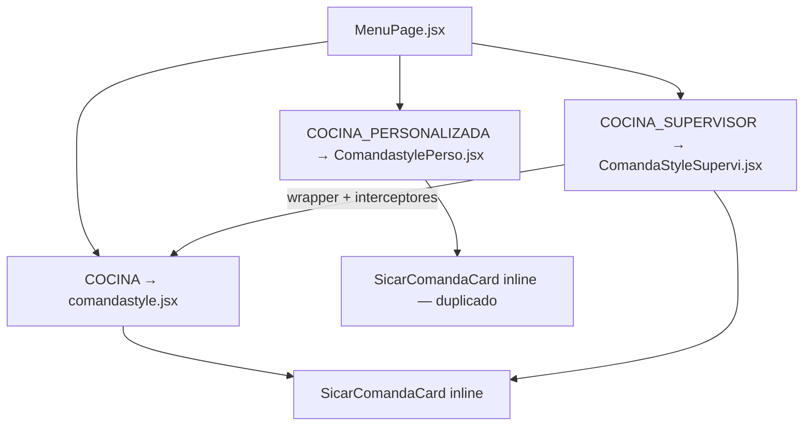

# Plan de Implementación SALIO — App Cocina (3 Tableros KDS)

**Fecha:** Junio 2026  
**Versión:** 1.0  
**App:** Cocina (React)  
**Plan maestro:** [`../../docs/PLAN_FLUJO_SALIO_ENTREGA_PLATOS.md`](../../docs/PLAN_FLUJO_SALIO_ENTREGA_PLATOS.md)

---

## 1. Resumen ejecutivo

El flujo actual de plato en cocina salta de **Preparado** (`recoger`) a desaparecer del tablero sin confirmación explícita. El mozo puede marcar `recoger → entregado` sin que cocina verifique la salida física del plato, mezclando dos responsabilidades: (a) el plato salió del pass (cocina) y (b) el plato llegó al comensal (mozo).

La solución introduce el estado **`salio`** entre `recoger` y `entregado`. Cuando el cocinero confirma que un plato salió de cocina, selecciónalo en la sección PREPARADOS (fondo rojo), pulsa el botón **"Entregar N plato(s)"** y el plato desaparece de la tarjeta. El mozo solo puede entregar platos que ya estén en `salio`.

---

## 2. Modelo de estados y responsabilidades

### 2.1 Transiciones relevantes para cocina

| Estado actual | Transición | Quién ejecuta | Resultado en KDS |
|---------------|------------|---------------|------------------|
| `pedido` / `en_espera` | → `recoger` | Cocina (Finalizar) | Aparece en PREPARADOS ✅ |
| `recoger` | → `salio` | **Cocina (Entregar del pass)** | **Desaparece de la tarjeta** |
| `salio` | → `entregado` | Mozo (no visible en KDS) | No aplica |
| `recoger` | → `en_espera` | Cocina (Revertir) | Vuelve a EN PREPARACIÓN |

> **Bloqueo clave:** `recoger → entregado` deja de ser válido. Solo `recoger → salio` es posible desde cocina.

### 2.2 Responsabilidades por rol

```
COCINA:   Finalizar preparación (→ recoger)  →  Entregar del pass (→ salio)
MOZO:     Recoger aviso (= recoger)  →  Confirmar entrega al comensal (→ entregado)
```

### 2.3 Qué se muestra en KDS vs app Mozos

| Estado | KDS (Cocina) | App Mozos | Color Mozos |
|--------|--------------|-----------|-------------|
| `pedido` / `en_espera` | EN PREPARACIÓN | PEDIDO | Celeste |
| `recoger` | PREPARADOS ✅ | RECOGER (solo aviso, sin checkbox) | Amarillo |
| `salio` | **No visible** — desapareció | SALIÓ (checkbox resaltante) | Verde |
| `entregado` | No visible | ENTREGADO | Verde oscuro |

---

## 3. Cambios en backend relevantes para App Cocina

Esta sección resume los cambios del backend que impactan el comportamiento de la app de cocina. Para detalles completos, ver el plan maestro.

### 3.1 Enum de estados

```javascript
// comanda.model.js — antes
enum: ['pedido', 'en_espera', 'recoger', 'entregado', 'pagado']

// comanda.model.js — después
enum: ['pedido', 'en_espera', 'recoger', 'salio', 'entregado', 'pagado']
```

Se agrega `tiempos.salio: Date` en el subdocumento de plato.

### 3.2 Transiciones válidas que afectan KDS

| Transición | Endpoint | Body | Efecto en KDS |
|------------|----------|------|----------------|
| `recoger → salio` | `PUT /api/comanda/:id/plato/:platoId/estado` | `{ nuevoEstado: 'salio', cocineroId }` | Plato desaparece de tarjeta |
| `PUT /api/comanda/:id/plato/:platoId/salir-cocina` (opcional) | — | `{ cocineroId }` | Idempotente con el anterior |
| `salio → en_espera` (revertir) | `PUT /api/comanda/:id/plato/:platoId/estado` | `{ nuevoEstado: 'en_espera', motivo }` | Plato vuelve a EN PREPARACIÓN |

### 3.3 Eventos Socket.io que cocina debe escuchar

| Evento | Cuándo se emite | Qué hace la app |
|--------|----------------|-----------------|
| `plato-actualizado` con `nuevoEstado: 'salio'` (emitido por otro tablero o por el propio) | Un plato pasa a `salio` | Remover plato de la tarjeta + limpiar `platoStates` |
| `plato-actualizado` con `nuevoEstado: 'en_espera'` (revertir) | Un plato vuelve de `salio` a cocina | Re-insertar plato en EN PREPARACIÓN |
| `plato-actualizado-batch` | Múltiples platos cambian a `salio` | Batch removal |

### 3.4 Archivos backend afectados

| Archivo | Cambio |
|---------|--------|
| `comanda.model.js` | Enum + `tiempos.salio` |
| `comanda.repository.js` | `validarTransicionPlato`, `recalcularEstadoComandaPorPlatos` |
| `comandaController.js` | `estadosValidos` incluir `salio` |
| `events.js` | Emitir `plato-actualizado` con `salio` |
| `pushNotifications.js` | Template push para mozos |

---

## 4. Cambios funcionales en los 3 tableros KDS

### 4.1 Arquitectura de los tableros



| Tablero | Archivo (~líneas) | Código compartido | Duplicación |
|---------|-------------------|-------------------|-------------|
| 1 General | `comandastyle.jsx` (~5 000) | Base | — |
| 2 Personalizada | `ComandastylePerso.jsx` (~5 000) | Ninguno con General | `SicarComandaCard` copiada |
| 3 Supervisor | `ComandaStyleSupervi.jsx` (~500) | Hereda de General | No duplica |

**Consecuencia:** Los cambios en Tablero 1 aplican también al Tablero 3. El Tablero 2 es independiente y debe replicarse manualmente.

### 4.2 Comportamiento actual vs. nuevo

| Aspecto | Actual | Nuevo |
|---------|--------|-------|
| Platos en PREPARADOS | Solo lectura, clic seleccióna comanda | Clic selecciona plato individual, fondo rojo si `entregando` |
| Estado visual en PREPARADOS | No existe | `entregando` (rojo) — ciclo `normal → entregando → normal` |
| Botón inferior para PREPARADOS | No existe (solo FINALIZAR para EN PREPARACIÓN) | **"Entregar N plato(s)"** verde oscuro `bg-green-800` |
| Acción al confirmar entrega | — | `PUT .../estado` `{ nuevoEstado: 'salio' }` |
| Plato que pasó a `salio` | Permanece visible | **Desaparece** de la tarjeta |
| Comanda sin platos visibles | Todavía se muestra | Se oculta si todos en `salio`/`entregado`/`pagado` |

### 4.3 Flujo de interacción por tablero

```
┌─────────────────────────────────────────────────────┐
│  SECCIÓN PREPARADOS (platos estado === 'recoger')    │
│                                                       │
│  [✓ Ceviche] ← clic → fondo cambia a ROJO            │
│  [  Lomo Saltado] ← clic → fondo cambia a ROJO       │
│                                                       │
│  ┌──────────────────────────────────────────────┐     │
│  │  🟢 Entregar 2 plato(s)                      │     │
│  └──────────────────────────────────────────────┘     │
│                                                       │
│  Al confirmar → API recoger→salio                    │
│  → Platos desaparecen de la tarjeta                   │
│  → Socket sincroniza en los otros tableros            │
└─────────────────────────────────────────────────────┘
```

### 4.4 Tablero 1 — Vista General (`comandastyle.jsx`)

Cambios directos:

| Zona del archivo | Cambio a realizar | Relación con backend/sockets |
|------------------|-------------------|------------------------------|
| Props del componente | Agregar `onSupervisorEntregarPlato` para Tablero 3 | Prop que se pasa desde `ComandaStyleSupervi.jsx` |
| `platoStates` Map | Nuevo estado visual `'entregando'` (rojo) para platos `recoger` seleccionados | Local-only, se sincroniza al recibir socket `salio` |
| `togglePlatoCheck` (~L1692) | Agregar rama: si `plato.estado === 'recoger'`, ciclo `normal → entregando → normal` | No llama API, solo marca UI |
| `determinarAccionBoton` (~L1973) | Nuevo modo `ENTREGAR_PLATO` cuando hay platos con `estadoBackend === 'recoger'` y `estadoVisual === 'entregando'`. Prioridad sobre `FINALIZAR_PLATO` | Determina qué botón mostrar y qué handler invocar |
| `handleEntregarPlatosGlobal` (nuevo) | Batch `recoger → salio` vía `PUT .../estado`. Si `isSupervisorView && onSupervisorEntregarPlato`, delegar al interceptor | Llama API → emite socket → en respuesta, limpiar `platoStates` y remover plato |
| Barra inferior (~L3402) | Caso `ENTREGAR_PLATO`: botón `Entregar ${n} plato(s)`, estilo `bg-green-800` | Conecta con `handleEntregarPlatosGlobal` |
| `SicarComandaCard` sección PREPARADOS (~L4855) | Reemplazar `onClick={onToggleSelect}` por handler de plato individual con `stopPropagation`. Estilo rojo si `entregando` | El clic individual permite seleccionar para entregar, no para seleccionar la comanda |
| Filtro `platosListos` (~L4480) | Solo incluir `estado === 'recoger'`. Platos en `salio` no se muestran | Al recibir socket `salio`, el plato ya no cumple el filtro y desaparece naturalmente |
| Socket handler | En `plato-actualizado` con `nuevoEstado === 'salio'`: remover plato de `comandas` y limpiar `platoStates` correspondiente | Requiere actualización de `useSocketCocina.js` o handler inline |

### 4.5 Tablero 2 — Vista Personalizada (`ComandastylePerso.jsx`)

**Replicar todos los cambios del Tablero 1** en este archivo independiente. Mismas funciones, mismas zonas:

- `togglePlatoCheck` (~L1692)
- `determinarAccionBoton` (~L1973)
- `SicarComandaCard` (~L4279), sección PREPARADOS (~L4855)
- Barra inferior (~L3398)
- Socket handler

**Adicional:** verificar filtros de zona en `kdsFilters.js`:

| Escenario | Comportamiento esperado |
|-----------|------------------------|
| Plato `recoger` en zona asignada del cocinero | Visible y seleccionable para entregar |
| Plato pasa a `salio` | Desaparece aunque la comanda tenga otros platos en preparación en la zona |
| Comanda sin platos visibles para la zona del cocinero | Tarjeta se oculta según `aplicarFiltrosAComandas` actual |

Relación con backend: misma API que Tablero 1, mismo socket, mismos filtros de zona ya existentes.

### 4.6 Tablero 3 — Vista Supervisor (`ComandaStyleSupervi.jsx`)

Hereda la UI de General. Solo se necesita un nuevo interceptor:

```javascript
// ComandaStyleSupervi.jsx
const handleSupervisorEntregarPlato = useCallback(async (platos) => {
  for (const plato of platos) {
    await entregarPlato(comandaId, plato.platoId, userId);
  }
  setResetKey(prev => prev + 1);
}, [userId, entregarPlato]);

// Prop nueva:
<ComandaStyle
  isSupervisorView={true}
  onSupervisorEntregarPlato={handleSupervisorEntregarPlato}
  // ... interceptores existentes (L362-369)
/>
```

Y en `comandastyle.jsx`, la función `handleEntregarPlatosGlobal` debe agregar:

```javascript
if (isSupervisorView && onSupervisorEntregarPlato) {
  onSupervisorEntregarPlato(platosAEntregar);
  return;
}
```

| Acción | General / Perso | Supervisor |
|--------|-----------------|------------|
| Finalizar preparación | `batchFinalizarPlatos` → `recoger` | Interceptado → `handleSupervisorFinalizarPlato` |
| Entregar del pass | `handleEntregarPlatosGlobal` → `salio` | Interceptado → `handleSupervisorEntregarPlato` (nuevo) |
| Auditoría | `cocineroId` del cocinero logueado | `userId` del supervisor en body |

> **Unificar:** Para entrega `salio`, usar `PUT .../estado` con `nuevoEstado: 'salio'` en los 3 tableros (no el hook `/finalizar`).

---

## 5. Listado de archivos y funciones a tocar

### 5.1 Código compartido (nuevos o modificados)

| Archivo | Función/sección | Cambio | Relación |
|---------|----------------|--------|----------|
| `src/hooks/useProcesamiento.js` | Agregar `entregarPlato(comandaId, platoId, cocineroId)` | Nuevo método que llama `PUT .../estado { nuevoEstado: 'salio' }` o el endpoint dedicado `/salir-cocina` | API backend |
| `src/hooks/useSocketCocina.js` | Handler `plato-actualizado` con `nuevoEstado === 'salio'` | Remover plato de `comandas` local + limpiar `platoStates` | Socket backend |
| `src/components/Principal/PlatoPreparado.jsx` | **Nuevo componente** | Fila clickeable de sección PREPARADOS con estado visual `entregando` (rojo). Props: `plato`, `comandaId`, `platoIndex`, `estadoVisual`, `onToggle`, `nightMode` | Consumido por Tablero 1 y 2 |
| `src/hooks/useEntregaPlotosKds.js` | **Nuevo hook** (opcional, recomendado) | Lógica extraída: `togglePlatoCheck` rama `recoger`, `determinarAccionBoton` modo `ENTREGAR_PLATO`, `handleEntregarPlatosGlobal` | Consumido por Tablero 1 y 2 |
| `src/hooks/useComandastyleCore.js` | Filtro de comandas | Asegurar que comandas donde todos los platos están en `salio`/`entregado` se excluyan del KDS | Socket + API |

### 5.2 Tablero 1 — Vista General (`comandastyle.jsx`)

| Función/sección (~línea) | Cambio | Relación |
|--------------------------|--------|----------|
| Props del componente (L70–79) | Agregar `onSupervisorEntregarPlato` | Prop para Tablero 3 |
| `platoStates` Map (L132–133) | Agregar estado `'entregando'` | Local UI |
| `togglePlatoCheck` (L1692) | Nueva rama para `plato.estado === 'recoger'`: `normal ↔ entregando` | UI + `determinarAccionBoton` |
| `determinarAccionBoton` (L1973) | Modo `ENTREGAR_PLATO` — prioridad sobre `FINALIZAR_PLATO` | Botón inferior |
| `handleEntregarPlatosGlobal` (nuevo) | Batch API: `PUT .../estado { nuevoEstado: 'salio' }` para cada plato seleccionado como `entregando`. Si `isSupervisorView`, delegar al interceptor | API + Socket |
| `handleBotonContextual` (L3400+) | Caso `ENTREGAR_PLATO`: llamar `handleEntregarPlatosGlobal` | Conecta barra con handler |
| `SicarComandaCard` sección PREPARADOS (L4855–4934) | Reemplazar `onClick={onToggleSelect}` por handler de plato individual. Estilo condicional rojo si `entregando` | UI |
| Barra inferior (L3400+) | Botón `Entregar ${n} plato(s)` con `bg-green-800` | UI |
| Socket handler (en `useSocketCocina` o inline) | Caso `nuevoEstado === 'salio'`: actualizar `comandas` y `platoStates` | Socket |
| `obtenerPlatosSeleccionadosInfo` (L1915) | Incluir platos con `estadoBackend === 'recoger'` y `estadoVisual === 'entregando'` | Determina información para el botón |

### 5.3 Tablero 2 — Vista Personalizada (`ComandastylePerso.jsx`)

| Función/sección (~línea) | Cambio | Nota |
|--------------------------|--------|------|
| Mismas zonas que Tablero 1 | Replicar exactamente los mismos cambios | Archivo duplicado, **no hereda** de General |
| `src/utils/kdsFilters.js` | Asegurar que `debeMostrarPlato` y `aplicarFiltrosAComandas` excluyan platos en `salio` | Solo zona Personalizada |

### 5.4 Tablero 3 — Vista Supervisor (`ComandaStyleSupervi.jsx`)

| Función/sección | Cambio | Relación |
|----------------|--------|----------|
| Handler nuevo `handleSupervisorEntregarPlato` | Llamar `entregarPlato()` del hook para cada plato seleccionado con `userId` del supervisor | Hereda UI de Tablero 1 + interceptor propio |
| Prop `onSupervisorEntregarPlato` pasada a `<ComandaStyle>` | Conectar con `handleEntregarPlatosGlobal` en `comandastyle.jsx` | Delegación |

### 5.5 Hooks y componentes existentes (sin cambio mayor)

| Archivo | Observación |
|---------|-------------|
| `PlatoPreparacion.jsx` | Sin cambio — solo maneja platos en preparación (`pedido`/`en_espera`) |
| `useAuth.jsx` | Sin cambio — proporciona `userId` para auditoría |
| `useBuscadorPlatos.js` | Sin cambio — búsqueda por nombre, no por estado |
| `useKdsBehavior.js` | Sin cambio — sorting y alertas por tiempo, no por estado |

---

## 6. Riesgos, edge cases y pruebas

### 6.1 Tableros múltiples abiertos simultáneamente

**Riesgo:** Si un cocinero tiene General y Personalizada abiertos en dos pestañas, la entrega funciona por socket. Al hacer `salio` en una pestaña, la otra recibe `plato-actualizado` y debe remover el plato.

**Mitigación:** El handler de socket debe:
1. Encontrar la comanda en `comandas` state.
2. Filtrar el plato eliminado o actualizar su estado a `salio`.
3. El filtro `platosListos` (solo `recoger`) ya excluye `salio`, así que el plato desaparece naturalmente.
4. Limpiar la entrada correspondiente en `platoStates` (si existía).

**Prueba manual:** Abrir dos pestañas con General y Personalizada. Entregar un plato en una. Verificar que desaparece en la otra en < 2 segundos.

### 6.2 Platos de varias zonas en la misma comanda

**Escenario:** Comanda con un ceviche (zona Fríos) y un lomo ( zona Plancha). El cocinero de Fríos entrega el ceviche (`salio`). El lomo sigue en PREPARADOS.

**Comportamiento esperado:**
- En Personalizada (zona Fríos): el ceviche desaparece, el lomo no era visible por zona → la comanda puede ocultarse si no hay más platos de Fríos.
- En General: el ceviche desaparece, el lomo sigue visible en PREPARADOS.
- En Supervisor: igual que General.

**Prueba manual:** Configurar zonas. Entregar plato de una zona. Verificar comportamiento en cada tablero.

### 6.3 Plato en `salio` no debe reaparecer en PREPARADOS

**Riesgo:** Si el socket se recibe desordenado o se hace un refresh, un plato en `salio` no debe aparecer de nuevo en la sección PREPARADOS.

**Mitigación:** El filtro `platosListos = platos.filter(p => p.estado === 'recoger')` ya excluye `salio`. Verificar que el GET inicial de comandas y el socket handler no re-inserten platos `salio` en el estado visual.

**Prueba de regresión:** Forzar un refresh completo del tablero. Los platos en `salio` no deben aparecer.

### 6.4 Revertir `salio → en_espera`

**Flujo:** Un cocinero entrega un plato por error (`salio`). Debe poder revertir con motivo.

**Implementación:** La barra inferior ya tiene un botón "REVERTIR" para platos en `recoger`. Extender para permitir revertir platos en `salio` a `en_espera` (que vuelve a EN PREPARACIÓN) con modal de motivo.

**Prueba:** Entregar un plato → revertir → el plato vuelve a aparecer en EN PREPARACIÓN.

### 6.5 Supervisor sin zonas

**Escenario:** El supervisor ve todas las comandas sin filtro de zona. La entrega de platos funciona igual que en General.

**Prueba:** Verificar que `handleSupervisorEntregarPlato` ejecuta la misma lógica que `handleEntregarPlatosGlobal` con `userId` del supervisor.

### 6.6 Propuestas de pruebas automatizadas

| Prueba | Archivo | Descripción |
|--------|---------|-------------|
| Transición `recoger → salio` | Tests de integración API | `PUT .../estado` con `{ nuevoEstado: 'salio', cocineroId }` devuelve 200 |
| Transición `salio → en_espera` (revertir) | Tests de integración API | Revertir funciona con motivo |
| Transición `recoger → entregado` bloqueada | Tests de integración API | Debe devolver 400 desde app mozo |
| Socket `plato-actualizado` con `salio` | Tests de socket | Se emite a `/cocina` y `/mozos` |
| UI: clic en preparado cambia a rojo | Tests de componente | `togglePlatoCheck` con `estado === 'recoger'` → `entregando` |
| UI: botón "Entregar N" visible | Tests de componente | `determinarAccionBoton` devuelve `ENTREGAR_PLATO` |

---

## 7. Referencias cruzadas

| Documento | Ubicación |
|-----------|-----------|
| Plan maestro | [`../../docs/PLAN_FLUJO_SALIO_ENTREGA_PLATOS.md`](../../docs/PLAN_FLUJO_SALIO_ENTREGA_PLATOS.md) |
| Plan App Mozos | [`../../gambusinas/docs/APP_MOZOS_PLAN_IMPLEMENTACION_SALIO.md`](../../gambusinas/docs/APP_MOZOS_PLAN_IMPLEMENTACION_SALIO.md) |
| Documentación completa Cocina | `appcocina/docs/automated/APP_COCINA_DOCUMENTACION_COMPLETA.md` |
| Diagrama flujo datos | `appcocina/docs/automated/DIAGRAMA_FLUJO_DATOS_Y_FUNCIONES.md` |
| Plan toma de plato supervisor | `appcocina/docs/PLAN_IMPLEMENTACION_SUPERVISOR_TOMA_PLATOS.md` |

---

*Documento v1.0 — Junio 2026. Generado a partir del análisis de `appcocina`, `gambusinas` y `backend-gambusinas`.*