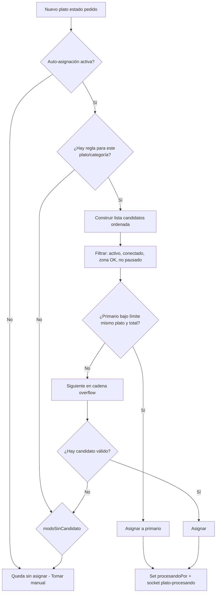

# Plan: Asignación Automática de Platos

**Fecha:** 15 julio 2026  
**Alcance:** `cocineros.html` (admin) + Backend + App Cocina (KDS)  
**Estado:** Plan / diseño — pendiente de implementación

---

## 1. Objetivo

Agregar en `cocineros.html` una pestaña nueva **a la izquierda de "Zonas"** llamada **Asignación Automática de Platos**.

Hoy los platos llegan al KDS sin cocinero (`procesandoPor` vacío) y alguien debe pulsar **Tomar**. Esta herramienta elimina esa dependencia: el backend asigna automáticamente cada plato nuevo al cocinero configurado, según reglas flexibles (por plato, categoría, overflow, carga, etc.).

**Resultado esperado en cocina:**

1. Entra una comanda → aparecen platos en el KDS.
2. El sistema elige cocinero según la matriz de reglas.
3. El plato queda con `procesandoPor` ya seteado (mismo modelo que “Tomar”).
4. El cocinero solo prepara y marca **Listo** (sigue pudiendo liberar / el supervisor reasignar).

---

## 2. Contexto actual (qué ya existe)

| Pieza | Estado | Uso para auto-asignación |
|-------|--------|---------------------------|
| `procesandoPor` en plato/comanda | ✅ | Registro oficial de “quién lo tiene” |
| `PUT .../plato/:platoId/procesando` | ✅ | Reutilizar lógica interna (no inventar otro campo) |
| Zonas + filtros KDS | ✅ | Solo **visibilidad**; no rutean platos |
| `platosEnCurso` por cocinero | ✅ (métricas) | Base para balanceo y límites |
| Socket `plato-procesando` | ✅ | Notificar KDS / monitores |
| Asignación automática | ❌ | No existe |
| Capacidad / overflow por plato | ❌ | No existe |
| Endpoint `/api/comanda/:id/asignar` | ❌ (stub FE) | Unificar o eliminar |

**Archivo UI admin:** `backend-gambusinas/public/cocineros.html`  
**Tabs actuales:** Cocineros → Zonas → Personalizar vista → Rendimiento  
**Nuevo orden:** Cocineros → **Asignación Automática** → Zonas → Personalizar vista → Rendimiento

---

## 3. UX propuesta en `cocineros.html`

### 3.1 Nueva pestaña

```
[👨‍🍳 Cocineros] [⚡ Asignación Automática] [📍 Zonas] [📺 Personalizar vista] [📊 Rendimiento]
```

Botón de cabecera (cuando `activeTab === 'asignacion'`):

- Toggle global **Activar / Pausar** asignación automática
- **Guardar cambios**
- (Opcional) **Simular** con un plato de prueba

### 3.2 Layout de la sección (una sola composición, dos paneles)

```
┌─────────────────────────────────────────────────────────────┐
│  Estado: ● Activa   Modo: Por plato + overflow   [Pausar]   │
├──────────────────────────┬──────────────────────────────────┤
│  CATÁLOGO DE PLATOS      │  REGLAS DEL PLATO / COCINERO     │
│  Buscar · Categoría      │  Cocinero primario               │
│  Lista de platos         │  Cocineros backup (overflow)     │
│  Badge: configurado / no │  Máx. del mismo plato (default 5)│
│                          │  Prioridad / peso                │
│                          │  Activo sí/no                    │
└──────────────────────────┴──────────────────────────────────┘
│  Matriz resumen (opcional): plato × cocineros               │
└─────────────────────────────────────────────────────────────┘
```

**Panel izquierdo — todos los platos existentes**

- Cargar desde catálogo de platos (API de platos ya usada en Zonas).
- Filtros: búsqueda, categoría, tipo, “solo sin configurar”.
- Indicador por fila: sin regla / con primario / con overflow.

**Panel derecho — configuración al seleccionar un plato**

| Campo | Descripción |
|-------|-------------|
| Activo | Si este plato entra en auto-asignación |
| Cocinero primario | Quién recibe el plato por defecto |
| Cocineros secundarios (ordenados) | Cadena de overflow / fallback |
| Máx. concurrentes del mismo plato | Default **5**; el 6º va al siguiente |
| Criterio de overflow | Ver §4 |
| También por categoría | Atajo: aplicar la misma regla a toda una categoría |
| Notas internas | Texto libre (ej. “solo parrilla”) |

### 3.3 Vista alternativa / complementaria: por cocinero

Sub-vista o modal:

- Seleccionar cocinero → checklist de platos (y/o categorías) que le corresponden.
- Útil para setup rápido (“Juan = carnes + parrilla”).
- Debe sincronizar con la matriz por plato (misma fuente de verdad).

### 3.4 Configuración global (arriba o drawer)

| Setting | Default sugerido | Notas |
|---------|------------------|-------|
| `habilitada` | `false` | Feature flag operativo |
| `maxMismoPlatoPorCocinero` | `5` | Override global; plato puede sobreescribir |
| `maxPlatosTotalesEnCurso` | `8`–`12` | Capacidad total del cocinero (cualquier plato) |
| `modoSinCandidato` | `dejar_sin_asignar` | Alternativas: `pool_supervisor`, `round_robin_zona` |
| `respetarZonas` | `true` | Solo asignar si el cocinero tiene zona que “ve” ese plato |
| `soloCocinerosConectados` | `true` | No asignar a quien no está en sesión KDS |
| `permitirReasignacionAuto` | `false` | Si se libera o se supera límite mid-prep |
| `origenAsignacion` | `auto` | Marcar en `procesandoPor` o metadata para UI |

---

## 4. Reglas de negocio (configurables)

### 4.1 Flujo base al aparecer un plato nuevo



### 4.2 Overflow “más de 5 del mismo plato”

**Requisito del negocio:** si un cocinero ya tiene **más de 5** platos **del mismo ítem** en curso, el siguiente (6º) se asigna a **otro cocinero elegido en la configuración**.

Definiciones claras:

- **Mismo plato** = mismo `platoId` / código de catálogo (no “misma categoría”).
- **En curso** = estados que aún prepara: `pedido`, `en_espera` (y opcionalmente mientras `procesandoPor` esté seteado).
- **No cuentan** platos ya en `recoger` / `salio` / `entregado`.

Cadena sugerida:

1. Primario (mientras `count(mismoPlato) < max`).
2. Backup 1, Backup 2… (orden configurable).
3. Si todos saturados → `modoSinCandidato`.

**Importante:** el “otro cocinero” **no es aleatorio por defecto**; lo elige el admin en la UI (lista ordenada). Opcionalmente, dentro de los backups, se puede activar “elegir el de menor carga”.

### 4.3 Modos de estrategia (para “configurar de muchas maneras”)

| Modo | Comportamiento | Cuándo usarlo |
|------|----------------|---------------|
| `fijo_por_plato` | Siempre el primario (salvo overflow) | Estaciones fijas (parrilla, frituras) |
| `fijo_por_categoria` | Regla a nivel categoría | Menús grandes, menos mantenimiento |
| `cadena_overflow` | Primario → backups ordenados | Requisito de los 5+1 |
| `menor_carga` | Entre candidatos elegibles, menor `platosEnCurso` | Turnos parejos |
| `round_robin` | Rotación entre candidatos | Evitar fatiga de uno solo |
| `hibrido` | Primario preferido; si supera umbral, menor carga entre backups | Recomendado en producción |
| `respetar_zona` | Candidatos ∩ cocineros de zonas que matchean el plato | Coherencia con Vista Personalizada |
| `horario` | Reglas distintas por franja (desayuno / almuerzo) | Cocinas con cambios de turno |

Se pueden combinar: p. ej. `fijo_por_plato` + `cadena_overflow` + `soloCocinerosConectados` + `respetarZonas`.

### 4.4 Prioridades y desempates (orden sugerido)

1. Plato tiene regla activa → usar candidatos de esa regla.  
2. Si no, regla de categoría.  
3. Si no, (opcional) cocineros de la zona que matchea el plato.  
4. Filtrar desconectados / inactivos / `autoAsignacion=false`.  
5. Aplicar límites (mismo plato + total en curso).  
6. Desempate: orden de backup → menor carga → round-robin → timestamp más antiguo de último plato asignado.

---

## 5. Modelo de datos propuesto

### 5.1 Colección / documento: `AsignacionAutomaticaConfig`

Una config por local/sistema (o embebida en `configuracionSistema`):

```js
{
  habilitada: Boolean,
  defaults: {
    maxMismoPlatoPorCocinero: 5,
    maxPlatosTotalesEnCurso: 10,
    modoSinCandidato: 'dejar_sin_asignar', // | 'pool_supervisor' | 'round_robin_zona'
    soloCocinerosConectados: true,
    respetarZonas: true,
    estrategiaDefault: 'hibrido'
  },
  reglasPorPlato: [
    {
      platoId: Number,
      activo: Boolean,
      cocineroPrimarioId: ObjectId,
      backups: [{ cocineroId: ObjectId, orden: Number }],
      maxMismoPlato: Number, // null = usar default
      estrategia: String,    // null = default
      notas: String
    }
  ],
  reglasPorCategoria: [
    {
      categoria: String,
      activo: Boolean,
      cocineroPrimarioId: ObjectId,
      backups: [...],
      maxMismoPlato: Number,
      estrategia: String
    }
  ],
  // Opcional fase 2
  reglasHorario: [{ desde: 'HH:mm', hasta: 'HH:mm', reglaRef: '...' }]
}
```

### 5.2 Extensión ligera en `ConfigCocinero`

```js
autoAsignacion: {
  acepta: true,           // opt-out por cocinero
  maxPlatosTotales: null, // override personal
  pausadoHasta: null      // break / limpieza
}
```

### 5.3 Metadata de asignación (recomendado)

En el plato, al auto-asignar, además de `procesandoPor`:

```js
asignacionMeta: {
  origen: 'auto' | 'manual' | 'supervisor' | 'overflow',
  regla: 'plato' | 'categoria' | 'zona',
  timestamp: Date
}
```

Sirve para badge en KDS (“⚡ Auto”) y auditoría, sin romper el flujo actual de Mozos / Cocina.

---

## 6. Backend — dónde enganchar

### 6.1 Punto de disparo (recomendado)

**Server-side**, inmediatamente después de crear/actualizar comanda con platos en `pedido`:

1. Hook en creación de comanda / agregados de platos (`comanda.repository` o post-save).
2. Servicio `asignacionAutomaticaService.asignarPlatosNuevos(comanda, platosNuevos)`.
3. Reutilizar lógica interna de `procesamientoController` (tomar sin JWT de cocinero, con flag sistema).
4. Emitir `plato-procesando` / `plato-actualizado` como hoy.

**No** auto-asignar solo en el cliente App Cocina: las TVs/monitores y otros PCs quedarían desfasados.

### 6.2 APIs nuevas

| Método | Endpoint | Uso |
|--------|----------|-----|
| GET | `/api/asignacion-automatica` | Config + reglas |
| PUT | `/api/asignacion-automatica` | Guardar config global + reglas |
| GET | `/api/asignacion-automatica/matriz` | Vista plato × cocineros |
| POST | `/api/asignacion-automatica/simular` | Dry-run: “¿a quién iría este plato?” |
| POST | `/api/asignacion-automatica/toggle` | Pausar/activar sin tocar reglas |

### 6.3 Contadores en tiempo real

Usar agregación existente de `platosEnCurso` y ampliar:

- `platosEnCursoPorCocinero[cocineroId]`
- `platosEnCursoPorCocineroYPlato[cocineroId][platoId]`

Cache corta en memoria/Redis (si aplica) invalidada en `plato-procesando`, `plato-liberado`, `finalizar`.

### 6.4 Concurrencia

Dos comandas simultáneas no deben superar el límite por race:

- Transacción / `findOneAndUpdate` con condición, o
- Lock corto por `cocineroId+platoId`, o
- Reintentar selección de candidato si el update falla por capacidad.

---

## 7. Integración App Cocina

| Vista | Cambio |
|-------|--------|
| `Comandastyle.jsx` / `ComandastylePerso.jsx` | Mostrar badge **Auto** / **Overflow** si `asignacionMeta.origen` |
| Supervisor | Sigue pudiendo forzar reasignación (`forzar=true`) |
| Tomar manual | Si ya tiene `procesandoPor` auto, no pedir Tomar; opcional “Reclamar” |
| Liberar | Vuelve al pool; opcional re-auto-asignar si `permitirReasignacionAuto` |
| Socket | Sin cambios de protocolo mayores; reusar `plato-procesando` |
| Mozos (`gambusinas`) | Ya respetan `procesandoPor`; auto-asignados se comportan como “tomados” |

**Recomendación de operación:** en turnos con auto-asignación, cocineros usen **Vista Personalizada** + zonas coherentes con las reglas, para no ver platos de otras estaciones.

---

## 8. Relación con Zonas (evitar confusión)

| Concepto | Qué hace |
|----------|----------|
| **Zonas** | Qué ve el cocinero en el tablero |
| **Asignación automática** | A quién se le **asigna** el plato (`procesandoPor`) |

**Recomendación:** mantener ambos, con `respetarZonas: true` por defecto:

- Un plato de “Parrilla” solo se auto-asigna a cocineros cuya zona incluye ese plato.
- Así no se asigna un ceviche a quien ni siquiera lo ve en su KDS.

Si se desactiva `respetarZonas`, la matriz por plato es la única autoridad (más flexible, más fácil de configurar mal).

---

## 9. Recomendaciones y sugerencias (App Cocina)

### 9.1 Operación diaria

1. **Arrancar en pausa** (`habilitada: false`), configurar matriz, **simular**, luego activar en horario valle.
2. **Default max = 5** del mismo plato; ajustar por estación (parrilla puede ser 3; ensaladas 8).
3. Siempre definir **al menos 1 backup** por plato crítico; sin backup, el 6º queda sin dueño.
4. Activar **soloCocinerosConectados** para no llenar la cola de alguien en break.
5. Usar **opt-out** por cocinero en breaks (`pausadoHasta` o `acepta: false`).
6. Supervisor debe seguir disponible: auto-asignación no reemplaza el criterio humano en picos o platos especiales.

### 9.2 Diseño de reglas

1. Preferir **por categoría** + excepciones por plato estrella (menos mantenimiento).
2. Modo **híbrido** en producción: primario fijo + overflow a menor carga entre backups.
3. Alinear reglas con **zonas** ya creadas (misma taxonomía de platos/categorías).
4. No duplicar lógica: filtros KDS = vista; reglas auto = ownership.
5. Platos compartidos (guarniciones) → varios backups + menor carga, no un solo primario.

### 9.3 UX en el KDS

1. Badge claro: `⚡ Auto` vs `👤 Manual` vs `🔁 Overflow`.
2. Sonido/alerta solo al cocinero asignado (room `cocinero-{id}`), no a toda la cocina.
3. Si un plato queda sin candidato, resaltarlo en Supervisor / Vista General.
4. No auto-cambiar `procesandoPor` mientras el cocinero está a mitad de prep (salvo liberación explícita).

### 9.4 Métricas y rendimiento

1. En tab **Rendimiento**: % auto vs manual, overflow rate, platos sin candidato.
2. Alertar si un cocinero supera `maxPlatosTotales` con frecuencia → falta de backups.
3. Historial simple: “Lomo #42 → Juan (auto) → Pedro (overflow)”.

### 9.5 Riesgos y mitigaciones

| Riesgo | Mitigación |
|--------|------------|
| Race en picos | Lock / reintento de candidato |
| Cocinero desconectado con platos | Liberar al logout o reasignar a backup |
| Regla desactualizada (plato nuevo) | KPI “platos sin regla” + filtro en UI |
| Conflicto con Tomar manual | Si ya auto-asignado, Tomar de otro = conflicto 409 o supervisor `forzar` |
| Confusión Zona vs Auto | Copy en UI: “Zonas = qué ves · Auto = a quién se asigna” |
| Endpoint `/asignar` muerto | Unificar con `/procesando` en la misma entrega |

### 9.6 Fases de implementación sugeridas

| Fase | Entrega | Valor |
|------|---------|-------|
| **P0** | Modelo + API + tab UI (matriz plato → primario + backups + max 5) + servicio en creación de comanda + flag global | Funciona el caso de negocio |
| **P1** | `soloConectados`, `respetarZonas`, badges KDS, simular, opt-out cocinero | Operable en turno real |
| **P2** | Reglas por categoría, horario, round-robin/híbrido, métricas overflow | Configuración rica |
| **P3** | Reasignación al liberar, alertas supervisor, historial, bulk-edit por categoría | Madurez |

---

## 10. Criterios de aceptación (P0)

1. En `cocineros.html` existe la pestaña **Asignación Automática** inmediatamente a la izquierda de **Zonas**.
2. Se listan todos los platos del catálogo y se puede elegir cocinero primario + backups.
3. Con la función **activada**, un plato nuevo en KDS aparece ya con `procesandoPor` del primario.
4. Si el primario tiene ≥ `max` (default 5) del **mismo** plato en curso, el siguiente se asigna al primer backup configurado.
5. Con la función **pausada**, el comportamiento sigue siendo 100% manual (Tomar).
6. Supervisor puede reasignar; Liberar funciona; Mozos ven el plato como tomado.
7. Socket actualiza App Cocina y monitores sin refresh.

---

## 11. Archivos principales a tocar (implementación futura)

| Área | Archivos |
|------|----------|
| UI admin | `backend-gambusinas/public/cocineros.html` |
| Modelo / API | nuevo model + controller + routes `asignacionAutomatica*` |
| Motor | nuevo `asignacionAutomaticaService.js` + hook en creación comanda |
| Procesamiento | `procesamientoController.js` (método interno sistema) |
| Socket | `events.js` (reuso; opcional evento `plato-auto-asignado`) |
| App Cocina | badges en `comandastyle*.jsx`, opcional `useProcesamiento` |
| Docs | este archivo + actualizar guías KDS / zonas |

---

## 12. Resumen ejecutivo

- Nueva pestaña **Asignación Automática de Platos** (antes de Zonas) configura **quién prepara qué** sin Tomar manual.
- Fuente de verdad: reglas por plato (y luego categoría) con **primario + cadena de overflow**.
- Límite clave: **máx. 5 del mismo plato** → el 6º al backup **elegido** en la UI.
- Ejecución **siempre en backend** reutilizando `procesandoPor`.
- Zonas siguen filtrando la vista; la auto-asignación define ownership; conviene `respetarZonas`.
- Arrancar con P0 + simulador, activar en valle, medir overflow y platos sin candidato.

---

*Documento de planificación. No implica código desplegado hasta que se apruebe e implemente por fases.*
