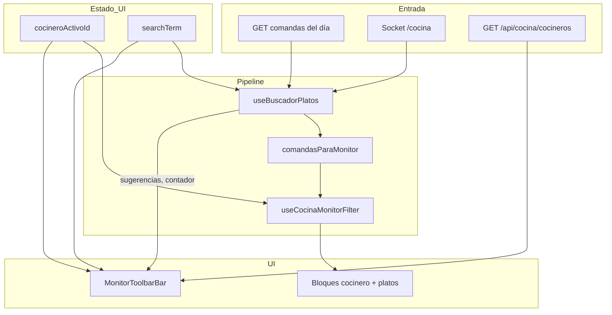

# Plan: Barra compacta de cocineros + buscador de platos en Ver Cocina Completo

**Versión:** 1.0  
**Fecha:** Julio 2026  
**Proyecto:** App Cocina (`appcocina`)  
**Estado:** Planificación — sin implementar  
**Relacionado con:**
- `PLAN_SELECTOR_COCINEROS_VER_COCINA_COMPLETO.md` (selector de cocineros — **implementado con pills**)
- `PLAN_VISTA_VER_COCINA.md` (monitor pasivo general)

---

## Resumen ejecutivo

En la vista **Ver Cocina Completo**, la barra de **Cocineros** actual ocupa demasiado espacio vertical porque muestra un pill por cada cocinero (`General`, `Juan`, `María`, `Pedro`…). Con muchos cocineros, la barra crece en varias filas y resta área útil al monitor de platos.

Este plan propone **rediseñar esa barra** en una sola fila compacta con:

| Control | Descripción |
|---------|-------------|
| **Selector de cocinero** | Cuadro tipo dropdown (`select`) de ancho fijo; una sola línea |
| **Buscador de platos** | Campo de texto que filtra por **nombre de plato** (y código de serie), con la **misma lógica** que el buscador de la tabla KDS de comandas |

Ambos filtros conviven en la misma barra y se combinan: primero búsqueda por plato, luego filtro por cocinero (o viceversa — ver §3.4).

---

## 1. Problema actual

### 1.1 Barra de cocineros (pills)

Implementación actual en `CocinaMonitorLayout.jsx` (líneas ~402–458):

```
┌──────────────────────────────────────────────────────────────────────────────┐
│  Cocinero:  [ General ]  [ Juan ]  [ María ]  [ Pedro ]  [ Carlos ]  ...   │
│             [ Ana ]  [ Luis ]  [ Rosa ]  ← segunda fila si no cabe           │
└──────────────────────────────────────────────────────────────────────────────┘
```

| Problema | Impacto |
|----------|---------|
| `flexWrap: wrap` con N pills | Con 6+ cocineros, la barra ocupa 2–3 filas (~80–120 px) |
| Cada pill ~100–150 px de ancho | En monitores de cocina (tablets/TVs cercanas) se pierde espacio de platos |
| Sin búsqueda de platos | El encargado no puede localizar rápido un plato específico en el monitor |

### 1.2 Búsqueda inexistente en el monitor

El buscador de platos **solo existe** en las tablas KDS operativas:

| Vista | Buscador |
|-------|----------|
| KDS General (`comandastyle.jsx`) | ✅ `SearchBar` + `useBuscadorPlatos` |
| KDS Personalizada (`ComandastylePerso.jsx`) | ✅ Igual |
| KDS Supervisor (`ComandaStyleSupervi.jsx`) | ❌ (fuera de alcance) |
| **Ver Cocina Completo** | ❌ No tiene buscador |
| Ver Cocina Personalizado | ❌ No tiene buscador |

---

## 2. Objetivo de diseño

### 2.1 Barra unificada compacta

Una sola fila debajo del header principal, altura fija ~44–48 px:

```
┌──────────────────────────────────────────────────────────────────────────────┐
│  🍳 VER COCINA — COMPLETO          Pendientes: 20    Urgentes: 3    14:32:05 │
├──────────────────────────────────────────────────────────────────────────────┤
│  Cocinero [▼ General        ]   🔍 [ Buscar plato...              ✕ ]  3 platos │
├──────────────────────────────────────────────────────────────────────────────┤
│  ... bloques de platos ...                                                   │
└──────────────────────────────────────────────────────────────────────────────┘
```

### 2.2 Selector de cocinero — cuadro compacto

| Aspecto | Especificación |
|---------|----------------|
| **Tipo de control** | `<select>` nativo o dropdown custom (recomendado: custom para estilo monitor) |
| **Ancho** | Fijo ~180–220 px |
| **Altura** | ~36–40 px (alineado con el buscador) |
| **Opciones** | `General` (valor `null`) + un ítem por cocinero activo |
| **Etiqueta visible** | Alias del cocinero seleccionado (no todos los nombres a la vez) |
| **Persistencia** | Igual que hoy: `localStorage` clave `cocinaMonitorCocineroId` |
| **Modo fijo / kiosk** | Barra oculta (sin cambios respecto al plan anterior) |

**Comportamiento funcional:** idéntico al selector de pills actual. Solo cambia la presentación.

### 2.3 Buscador de platos

| Aspecto | Especificación |
|---------|----------------|
| **Placeholder** | `Buscar plato...` |
| **Filtra por** | Nombre de plato + código de serie (L1, M23, D345…) |
| **Lógica** | **Reutilizar `useBuscadorPlatos`** — misma puntuación, fuzzy match, sugerencias |
| **UI** | Reutilizar `SearchBar` o variante compacta con tema del monitor |
| **Contador** | Mostrar platos encontrados cuando hay filtro activo (ej. `3 platos`) |
| **Sugerencias** | Dropdown de sugerencias al escribir (igual que KDS) |
| **Persistencia** | **No** persistir en `localStorage` (búsqueda efímera de sesión) |
| **Alcance** | Solo platos que el monitor ya mostraría (tomados + `pedido`/`en_espera`) |

---

## 3. Diseño técnico

### 3.1 Archivos involucrados

```
appcocina/src/
├── components/monitor/
│   ├── CocinaMonitorCompleto.jsx       ← estado searchTerm + pipeline de filtros
│   ├── CocinaMonitorLayout.jsx         ← reemplazar pills por barra unificada
│   ├── CocineroSelectorDropdown.jsx    ← NUEVO: select compacto de cocinero
│   └── MonitorToolbarBar.jsx           ← NUEVO (opcional): barra cocinero + buscador
├── components/additionals/
│   └── SearchBar.jsx                   ← reutilizar o extraer props de tema
└── hooks/
    ├── useBuscadorPlatos.js            ← reutilizar sin cambios (ideal)
    └── useCocinaMonitorFilter.js       ← sin cambios si el pipeline es correcto
```

### 3.2 Componente `CocineroSelectorDropdown` (nuevo)

Responsabilidad: encapsular el selector compacto, desacoplando el layout del monitor.

```jsx
// Props
{
  cocineros: Array,           // [{ _id, alias, name }]
  valor: string | null,       // null = General
  onChange: (id) => void,
  loading?: boolean,
  conteosPorCocinero?: Map,   // opcional fase 2: "Juan (12)"
  colorAcento, colorFondo, colorTextoPrincipal, colorTextoSecundario,
  disabled?: boolean,          // modo kiosk con cocineroIdFijo
}
```

**Opciones del dropdown:**

```
General
─────────────
Juan
María
Pedro
```

Estilo alineado al monitor (fondo oscuro, borde dorado tenue, texto claro). Chevron `▼` a la derecha.

### 3.3 Integración del buscador — reutilizar KDS

#### Hook existente: `useBuscadorPlatos`

Ubicación: `src/hooks/useBuscadorPlatos.js`

| Característica | Comportamiento |
|----------------|----------------|
| Normalización | Minúsculas, sin tildes (`normalizarTexto`) |
| Campos | `obtenerNombrePlato(plato)`, `obtenerCodigoPlato(plato)` |
| Puntuación | Exacta > empieza con > palabra completa > contiene > fuzzy (Levenshtein ≥70%) |
| Códigos | L1, M23, D345 — exacto, prefijo, solo dígitos |
| Debounce funcional | **No** — filtra en cada keystroke (spinner UI a 450 ms) |
| Sugerencias | Hasta 8, por nombre y palabras clave |

#### Patrón de integración en `CocinaMonitorCompleto`

```javascript
import useBuscadorPlatos from '../../hooks/useBuscadorPlatos';

const [searchTerm, setSearchTerm] = useState('');

const {
  comandasFiltradas,
  totalPlatosEncontrados,
  hayFiltroActivo,
  sugerencias,
} = useBuscadorPlatos(comandas, searchTerm, {
  soloUltimaComanda: false,  // monitor muestra todo el día, no solo última comanda
});

// Adaptar comandas para que useCocinaMonitorFilter use solo platos coincidentes
const comandasParaMonitor = useMemo(() => {
  if (!hayFiltroActivo) return comandas;
  return comandasFiltradas.map(c => ({
    ...c,
    platos: c.platosFiltrados ?? c.platos,
  }));
}, [comandas, comandasFiltradas, hayFiltroActivo]);

const platosPendientesRaw = useCocinaMonitorFilter(
  comandasParaMonitor,
  null,
  { criterio: 'prioridad', direccion: 'desc' },
  { agruparPorCocinero: true, cocineroIdFiltrado: cocineroActivoId }
);
```

Este es el **mismo patrón** que `comandastyle.jsx` (líneas ~1318 y ~4745): cuando hay búsqueda activa, cada comanda lleva solo `platosFiltrados` como `platos`.

#### Diferencia respecto al KDS (esperada y correcta)

| KDS comandas | Ver Cocina Completo |
|--------------|---------------------|
| Muestra platos en cualquier estado operativo | Solo platos **tomados** (`procesandoPor`) en `pedido`/`en_espera` |
| Puede ocultar comandas sin coincidencias | `useCocinaMonitorFilter` descarta platos no tomados después del buscador |

Resultado: si se busca "Lomo" y hay 5 lomos en comandas pero solo 2 tomados, el monitor muestra **2** (no 5). Comportamiento coherente con la naturaleza del monitor.

#### Sugerencias y platos no tomados (caso borde)

`useBuscadorPlatos` genera sugerencias desde **todas** las comandas del día. Una sugerencia puede apuntar a un plato aún no tomado → al seleccionarla, el monitor puede quedar vacío.

| Fase | Solución |
|------|----------|
| **MVP (P0)** | Aceptar este caso; empty state: "Ningún plato tomado coincide con «lomo»" |
| **P1 (opcional)** | Filtrar sugerencias a solo nombres de platos con `procesandoPor` activo |

### 3.4 Orden de filtros combinados

```
comandas (socket + API)
    │
    ▼
useBuscadorPlatos(searchTerm)     ← filtra por nombre/código de plato
    │
    ▼
comandasParaMonitor               ← solo platos coincidentes por comanda
    │
    ▼
useCocinaMonitorFilter(cocineroIdFiltrado)  ← filtra por cocinero + agrupa
    │
    ▼
platosPendientes (bloques UI)
```

Los dos filtros son **independientes y acumulativos**:

| Cocinero | Búsqueda | Resultado |
|----------|----------|-----------|
| General | (vacío) | Todos los platos tomados |
| Juan | (vacío) | Solo platos de Juan |
| General | "lomo" | Lomos tomados de cualquier cocinero |
| Juan | "lomo" | Lomos tomados **solo de Juan** |

### 3.5 Cambios en `CocinaMonitorLayout`

**Eliminar** el bloque de pills inline (líneas ~402–458).

**Agregar** nueva barra unificada con props:

| Prop nueva | Tipo | Descripción |
|------------|------|-------------|
| `searchTerm` | `string` | Término de búsqueda actual |
| `onSearchChange` | `Function` | `(term) => void` |
| `totalPlatosEncontrados` | `number` | Del hook buscador |
| `hayFiltroBusqueda` | `boolean` | Si hay texto en el buscador |
| `sugerencias` | `Array` | Sugerencias para `SearchBar` |
| `onSugerenciaClick` | `Function` | Al elegir sugerencia |

Layout CSS (inline styles, coherente con el monitor):

```javascript
{
  padding: '6px 24px',
  borderBottom: `1px solid ${colorAcento}11`,
  display: 'flex',
  gap: '12px',
  alignItems: 'center',
  flexShrink: 0,
  minHeight: '44px',
  flexWrap: 'nowrap',  // una sola fila
}
```

Distribución horizontal:

| Zona | Flex | Ancho |
|------|------|-------|
| Label "Cocinero" + dropdown | `0 0 auto` | ~220 px |
| Buscador | `1 1 auto` | crece (min ~200 px) |
| Contador resultados | `0 0 auto` | ~80 px, solo si `hayFiltroBusqueda` |

### 3.6 Adaptación visual de `SearchBar` para el monitor

`SearchBar` actual usa **Tailwind** (tema claro/oscuro KDS). El monitor usa **inline styles** con paleta `#0a0a0f` + acento dorado.

**Opción recomendada (P0):** agregar props opcionales de tema a `SearchBar`:

```javascript
// SearchBar.jsx — props nuevas (opcionales, default = estilo KDS actual)
variant = 'kds' | 'monitor'
monitorTheme = {
  colorFondo, colorTextoPrincipal, colorTextoSecundario, colorAcento,
}
compact = false  // true en monitor: menos padding, sin borde grueso
```

**Alternativa:** crear `MonitorSearchBar.jsx` que envuelva la lógica de `SearchBar` con estilos inline. Menos DRY pero sin tocar KDS.

### 3.7 Contadores del header

Cuando hay filtro de búsqueda y/o cocinero activo, el contador **Pendientes** debe reflejar el total **después** de ambos filtros (ya ocurre si se calcula desde `platosPendientes`).

Empty state contextual ampliado:

| Contexto | Mensaje |
|----------|---------|
| Sin platos tomados | "No hay platos tomados pendientes de preparación" |
| Cocinero X sin platos | "Juan no tiene platos pendientes en este momento ✓" |
| Búsqueda sin resultados | "Ningún plato tomado coincide con «{término}»" |
| Búsqueda + cocinero sin resultados | "Juan no tiene platos que coincidan con «{término}»" |

### 3.8 Backend

**Sin cambios.** Toda la lógica es frontend. Los endpoints existentes (`GET /api/comanda/cocina/:fecha`, `GET /api/cocina/cocineros`) siguen igual.

---

## 4. Wireframes

### 4.1 Antes (actual — pills)

```
Header:  [🍳 VER COCINA — COMPLETO]     Pendientes: 30 | Urgentes: 5 | Hora | ⚙
Barra:   Cocinero: [General*] [Juan] [María] [Pedro] [Carlos] [Ana]
         [Luis] [Rosa]                              ← ocupa 2 filas
Lista:   bloques por cocinero...
```

### 4.2 Después (propuesto — barra compacta)

```
Header:  [🍳 VER COCINA — COMPLETO]     Pendientes: 8 | Urgentes: 2 | Hora | ⚙
Barra:   Cocinero [▼ Juan ▾]  🔍 [ lomo saltado                    ✕ ]  3 platos
Lista:   solo bloques que coinciden...
```

### 4.3 Dropdown abierto

```
┌─────────────────────┐
│ ▼ Juan              │
├─────────────────────┤
│   General           │
│ ─────────────────── │
│   Juan           ✓  │
│   María             │
│   Pedro             │
│   Carlos            │
└─────────────────────┘
```

### 4.4 Buscador con sugerencias (igual que KDS)

```
🔍 [ lo▮                    ]  2 platos
   ┌──────────────────────────────┐
   │ 🍽 Lomo Saltado              │
   │ 🍽 Lomo a lo Pobre           │
   │ 🔤 código L923               │
   └──────────────────────────────┘
```

---

## 5. Flujo de datos



---

## 6. Fases de implementación

### Fase 1 — MVP (P0)

| # | Tarea | Archivo(s) | Esfuerzo |
|---|-------|------------|----------|
| 1 | Crear `CocineroSelectorDropdown` | `components/monitor/CocineroSelectorDropdown.jsx` | S |
| 2 | Integrar `useBuscadorPlatos` en Completo | `CocinaMonitorCompleto.jsx` | M |
| 3 | Reemplazar pills por barra unificada | `CocinaMonitorLayout.jsx` | M |
| 4 | Adaptar `SearchBar` con `variant="monitor"` o crear wrapper | `SearchBar.jsx` o `MonitorSearchBar.jsx` | M |
| 5 | Empty states para búsqueda sin resultados | `MonitorEmptyState.jsx`, `CocinaMonitorCompleto.jsx` | S |
| 6 | Verificar contador Pendientes con filtros activos | `CocinaMonitorLayout.jsx` | S |

### Fase 2 — Pulido (P1)

| # | Tarea |
|---|-------|
| 7 | Badge de conteo por cocinero en opciones del dropdown: `Juan (12)` |
| 8 | Filtrar sugerencias a solo platos tomados (evitar sugerencias vacías) |
| 9 | Atajo teclado `/` o `Ctrl+K` para enfocar buscador |
| 10 | Atajo `Esc` para limpiar búsqueda |
| 11 | Tests: pipeline buscador + filtro cocinero + agrupación monitor |

### Fase 3 — Fuera de alcance inicial

| # | Tarea | Notas |
|---|-------|-------|
| 12 | Buscador en Ver Cocina Personalizado | Solo si se solicita |
| 13 | Persistir último término de búsqueda | No recomendado (búsqueda efímera) |
| 14 | Buscador en modo fijo TV | No; TVs no tienen interacción de búsqueda |

---

## 7. Criterios de aceptación

### Selector compacto de cocinero

- [ ] La barra de cocineros ocupa **una sola fila** con 10+ cocineros en pantalla 1366×768
- [ ] El dropdown muestra `General` + todos los cocineros activos
- [ ] Seleccionar un cocinero filtra igual que los pills actuales (sin regresión)
- [ ] La selección persiste en `localStorage` (`cocinaMonitorCocineroId`)
- [ ] En modo fijo/kiosk la barra no aparece

### Buscador de platos

- [ ] El campo de búsqueda está en la misma barra que el selector de cocinero
- [ ] Filtra por **nombre de plato** con la misma lógica que KDS (`useBuscadorPlatos`)
- [ ] Filtra por **código de serie** (L1, M23, D345) igual que KDS
- [ ] Búsqueda sin tildes y case-insensitive ("LOMO" = "lomo" = "Lomó")
- [ ] Muestra sugerencias al escribir (dropdown)
- [ ] Botón ✕ limpia la búsqueda
- [ ] Contador de platos encontrados visible cuando hay filtro activo
- [ ] Solo muestra platos **tomados** que coinciden (no platos sin `procesandoPor`)
- [ ] Búsqueda + filtro cocinero funcionan juntos (intersección)
- [ ] Al limpiar búsqueda, se restaura la vista completa del cocinero seleccionado

### Regresión

- [ ] Ver Cocina Personalizado no muestra barra de cocineros ni buscador
- [ ] Agrupación por cocinero + plato sigue funcionando con filtros activos
- [ ] Temporizadores individuales no se rompen al filtrar
- [ ] Actualizaciones socket refrescan resultados de búsqueda en tiempo real
- [ ] KDS General/Personalizada: `SearchBar` sin cambios visuales (si se tocó el componente)

---

## 8. Comparativa con buscador KDS

| Aspecto | KDS Comandas (`comandastyle.jsx`) | Ver Cocina Completo (propuesto) |
|---------|-----------------------------------|----------------------------------|
| Hook | `useBuscadorPlatos` | **Mismo hook** |
| Componente UI | `SearchBar` | `SearchBar` con tema monitor |
| Datos de entrada | `comandas` del KDS | `comandas` del monitor (`useCocinaMonitorData`) |
| `soloUltimaComanda` | Configurable por regla KDS | `false` (todo el día) |
| Platos visibles | Todos los operativos en la comanda | Solo tomados (`useCocinaMonitorFilter`) |
| Toggle mostrar/ocultar | Botón en header KDS | Siempre visible en la barra |
| Estilo | Tailwind KDS | Inline styles monitor oscuro |
| Combina con | Filtros de zona/cocinero KDS | Selector dropdown de cocinero |

---

## 9. Referencias en el codebase

| Recurso | Ruta |
|---------|------|
| Monitor completo | `appcocina/src/components/monitor/CocinaMonitorCompleto.jsx` |
| Layout + pills actuales | `appcocina/src/components/monitor/CocinaMonitorLayout.jsx` |
| Filtro monitor | `appcocina/src/hooks/useCocinaMonitorFilter.js` |
| Lista cocineros | `appcocina/src/hooks/useCocinerosLista.js` |
| **Hook buscador KDS** | `appcocina/src/hooks/useBuscadorPlatos.js` |
| **UI buscador KDS** | `appcocina/src/components/additionals/SearchBar.jsx` |
| Integración KDS referencia | `appcocina/src/components/Principal/comandastyle.jsx` (~1318, ~3513) |
| Helpers nombre/código plato | `appcocina/src/utils/platoHelpers.js` |
| Plan selector cocineros (v1 pills) | `appcocina/docs/PLAN_SELECTOR_COCINEROS_VER_COCINA_COMPLETO.md` |
| Plan monitor general | `appcocina/docs/PLAN_VISTA_VER_COCINA.md` |

---

## 10. Glosario

| Término | Significado |
|---------|-------------|
| **Barra unificada** | Fila única con selector de cocinero + buscador de platos |
| **Dropdown / cuadro selector** | Control compacto que muestra solo el cocinero activo |
| **useBuscadorPlatos** | Hook compartido del KDS para filtrar platos por texto |
| **platosFiltrados** | Subconjunto de platos que coinciden con la búsqueda (por comanda) |
| **General** | Vista sin filtro por cocinero; todos los platos tomados |

---

## 11. Migración desde pills

El plan `PLAN_SELECTOR_COCINEROS_VER_COCINA_COMPLETO.md` documentó pills como UI definitiva. Este plan **reemplaza solo la presentación** del selector; la lógica de filtro (`cocineroIdFiltrado`, `localStorage`, endpoint `/api/cocina/cocineros`) **no cambia**.

| Capa | ¿Cambia? |
|------|----------|
| `useCocinerosLista` | No |
| `useCocinaMonitorFilter` + `cocineroIdFiltrado` | No |
| `localStorage` cocinero | No |
| UI pills → dropdown | **Sí** |
| Buscador de platos | **Nuevo** |

---

*Documento v1.0 — listo para revisión e implementación Fase 1.*
