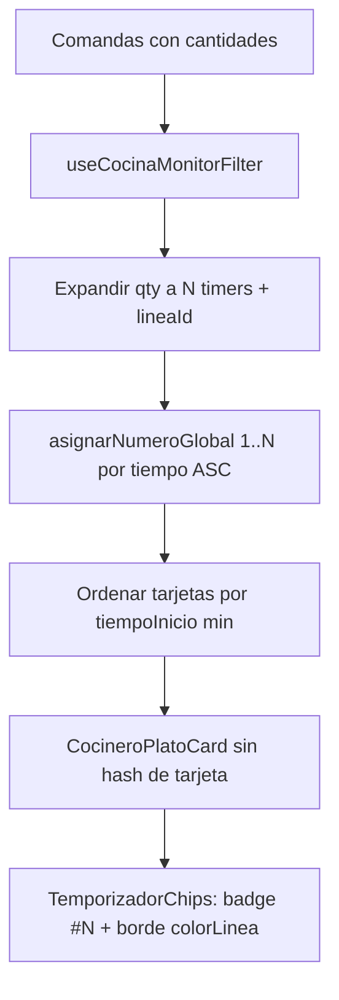

# Plan: Numeración global de temporizadores (sin conflicto con tarjeta)

**Versión:** 1.0  
**Fecha:** Julio 2026  
**Proyecto:** App Cocina (`appcocina`) + Backend (`backend-gambusinas`)  
**Estado:** Implementado (Julio 2026) — UI de numeración global + expandir cantidades.  
Finalización por unidad en backend: pendiente (al completar la línea salen todos sus timers).  
**Relacionado con:**
- `PLAN_ORDEN_NUMERACION_ESPACIO_PLATOS_COMPLETO.md` (orden de tarjetas + `#N` en tarjeta — **este plan lo evoluciona**)
- `PLAN_VISTA_VER_COCINA.md`
- `PLAN_SELECTOR_COCINEROS_VER_COCINA_COMPLETO.md`

---

## 1. Problema

En **Ver Cocina Completo** (vista de cocineros) conviven **dos enumeraciones**:

| Numeración | Dónde | Qué numera hoy |
|------------|--------|----------------|
| Tarjeta `#1`, `#2`… | Izquierda arriba / junto al nombre | Grupos de plato (Patasca, Papa a la huancaína…) |
| Timer `1-`, `2-`… | Dentro de cada tarjeta | Temporizadores de ese plato (comandas distintas) |

Eso genera confusión: el cocinero ve un `#2` en la tarjeta y un `1-` / `2-` en los timers del mismo bloque.

Además:

1. **Cantidad por comanda mal reflejada:** si una comanda pide 2 o 4 patascas, hoy se crea **1 timer por línea** (no por unidad). La fuente de verdad es `comanda.cantidades[i]`, pero el filtro usa `plato.cantidad || 1` (casi siempre 1).
2. **Sin vínculo visual entre unidades de la misma comanda:** no hay contorno compartido que diga “estos 2 timers son la misma comanda”.

---

## 2. Solución (modelo único)

**Una sola enumeración en pantalla: la de los temporizadores, global en la vista del cocinero.**

1. **Quitar** el número de orden de la tarjeta (`numeroOrden` en icono / badge).
2. **Enumerar cada temporizador** con el mismo lenguaje visual que tenía el número de la tarjeta (tamaño `#N` grande, a la **izquierda** del cronómetro).
3. La secuencia es **global** entre todos los timers visibles del cocinero (no reinicia por tarjeta).
4. Al completarse el más antiguo, el resto **se reenumera** y las tarjetas **reordenan** (más viejo a la izquierda).
5. Si una línea de comanda tiene cantidad `N`, se muestran **N temporizadores**; los de la misma comanda comparten **el mismo color de contorno**.

### Ejemplo operativo

Estado inicial (mismo cocinero):

| Plato (tarjeta) | Timers (nº global) |
|-----------------|--------------------|
| Patasca | `#1`, `#3`, `#4` |
| Papa a la huancaína | `#2` |

Orden visual de tarjetas (por timer más antiguo de cada grupo): **Patasca** (tiene el `#1`) → **Papa** (tiene el `#2`).

Se completa la primera patasca (`#1`):

| Plato | Timers |
|-------|--------|
| Papa a la huancaína | `#1` |
| Patasca | `#2`, `#3` |

Papa pasa a la **izquierda** (ahora es el más antiguo). Patascas restantes se reenumeran.

### Ejemplo cantidad misma comanda

Comanda pide **2 patascas** (una línea, `cantidades[i] = 2`):

- Se muestran **2 temporizadores** (misma hora de toma, misma mesa/comanda).
- Contorno del mismo color (misma `lineaId`).
- Reciben dos números globales consecutivos según edad respecto al resto de la cocina (p. ej. `#5` y `#6` si son los más nuevos).

---

## 3. Situación actual (código)

| Pieza | Archivo | Hoy |
|-------|---------|-----|
| Sort tarjetas Completo | `CocinaMonitorCompleto.jsx` | `criterio: 'tiempo'`, `asc` |
| `#N` tarjeta | `CocineroPlatoCard.jsx` + `CocinaMonitorLayout.jsx` | `numeroOrden={index+1}` |
| Timers por línea | `useCocinaMonitorFilter.js` ~225–232 | 1 timer por plato tomado; comentario: *no por unidad* |
| Nº local timer | `TemporizadorChips.jsx` ~67, ~120 | `idx + 1` → `1-`, `2-` **por tarjeta** |
| Color timer | `TemporizadorChips.jsx` | Solo por alerta (amarillo/rojo/acento) |
| Cantidad real | `comanda.model.js` → `cantidades[]` | El filtro **no** la lee |

Forma actual de un timer:

```js
{ tiempoInicio, cantidad, mesa, comandaNumero }
```

---

## 4. Modelo de datos propuesto

Cada timer (unidad de trabajo visible):

```js
{
  tiempoInicio,          // Date — mismo para unidades de la misma línea al tomar
  mesa,
  comandaNumero,
  comandaId,             // string
  platoIndex,            // índice en comanda.platos
  unidadIndex,           // 0 .. qty-1
  lineaId,               // `${comandaId}:${platoIndex}` — agrupa contorno
  colorLinea,            // hex de paleta estable por lineaId
  numeroGlobal,          // 1..N asignado en layout / post-filtro
  // opcionales para finalizar por unidad:
  platoId / key de finalización
}
```

**Resolución de cantidad:**

```js
const qty = comanda.cantidades?.[platoIndex] ?? plato.cantidad ?? 1;
for (let u = 0; u < qty; u++) {
  grupo.timers.push({ /* ... unidadIndex: u, lineaId, ... */ });
}
grupo.cantidadTotal += qty; // suma real de unidades
```

**`colorLinea`:** hash de `lineaId` sobre paleta fija (p. ej. 8 colores distintos del acento de alerta), estable entre re-renders.

---

## 5. Numeración global y orden de tarjetas

### 5.1 Asignación de `numeroGlobal`

Tras tener los grupos del filtro (vista filtrada al cocinero / bloque):

1. Aplanar todos los `timers` visibles.
2. Ordenar por `tiempoInicio` ASC (empate: `lineaId`, luego `unidadIndex`).
3. Asignar `numeroGlobal = 1 … N`.
4. Reinyectar en cada grupo.timers.

Ámbito:

| Vista | Alcance del 1…N |
|-------|------------------|
| Cocinero filtrado / kiosko | Todos los timers de ese cocinero |
| General + bloques | Por bloque de cocinero (cada cocinero su 1…N) |
| General + tarjetas planas | Global de toda la lista visible |

### 5.2 Orden de tarjetas

Se mantiene sort de grupos por `tiempoInicio` del grupo (mínimo de sus timers) ASC.

Efecto: la tarjeta que contiene el `#1` queda primera (izquierda / arriba). Al desaparecer ese timer, la que ahora tenga el mínimo tiempo (nuevo `#1`) ocupa esa posición.

### 5.3 UI del número

- **Eliminar** badge `#N` de la tarjeta (icono cocinero vuelve a foto/iniciales en modo grid).
- En `TemporizadorChips`: a la izquierda del cronómetro, badge `#N` con el **mismo tamaño/estilo** que el número que hoy va arriba-izquierda en la tarjeta (no el `1-` chico actual).
- El fill/glow del chip sigue reflejando **alerta por tiempo**; el **contorno** usa `colorLinea` cuando hay varias unidades de la misma línea (o siempre, para consistencia).

---

## 6. Contorno compartido por comanda

| Caso | Contorno |
|------|----------|
| 2+ timers con mismo `lineaId` | Mismo `colorLinea` en `border` |
| Timer de línea única (qty 1) | `colorLinea` o acento; alerta sigue en fondo/glow |
| Alerta roja/amarilla | Fondo/glow por alerta; **borde** prioriza `colorLinea` para no perder el agrupamiento |

Así el cocinero lee: “mismo borde = misma comanda / misma línea”; “número = orden global de antigüedad”.

---

## 7. Completar una unidad y reenumerar

### 7.1 Timers de comandas distintas (caso del ejemplo Patasca/Papa)

Ya encaja con el flujo actual: al finalizar/pasar a `recoger` esa línea, desaparece su timer → se recalcula `numeroGlobal` y el sort de tarjetas.

### 7.2 Timers de la misma comanda (qty ≥ 2)

Hoy finalizar la línea suele cerrar **toda** la cantidad de golpe. Para que “completar la primera de 2 patascas” deje un timer:

**Enfoque elegido:** soporte de **finalización por unidad** (decremento).

| Capa | Cambio |
|------|--------|
| Backend | Endpoint o extensión de finalizar plato: aceptar `unidades: 1` (default = toda la cantidad restante). Decrementar `cantidades[i]`; si llega a 0, marcar plato listo/`recoger` como hoy. |
| Filtro monitor | `qty` restante = `cantidades[i]`; emite exactamente `qty` timers. |
| Socket | Emitir actualización de comanda para que el monitor reenumere en vivo. |

Si en una primera iteración solo se hace la UI de N timers sin API de unidad, al completar la línea saldrían los N a la vez (documentar como limitación temporal). **El plan completo incluye la finalización por unidad** para alinear con el ejemplo operativo.

---

## 8. Archivos a tocar

| Archivo | Cambio |
|---------|--------|
| `useCocinaMonitorFilter.js` | Leer `cantidades[i]`; expandir N timers; `lineaId`, `unidadIndex`, `comandaId` |
| `CocinaMonitorLayout.jsx` (o helper) | Asignar `numeroGlobal`; dejar de pasar `numeroOrden` de tarjeta (o ignorarlo) |
| `CocineroPlatoCard.jsx` | Quitar UI de `#numeroOrden`; pasar timers ya numerados |
| `TemporizadorChips.jsx` | Badge `#numeroGlobal` grande a la izquierda; borde `colorLinea` |
| `MesaChips.jsx` | Contar mesas por `lineaId` único (no inflar ×N unidades) |
| `PlatoMonitorRow.jsx` | Alinear si sigue usándose en Completo |
| Backend `comandaController` (finalizar) | Decemento por unidad |
| Doc | Este archivo; actualizar referencia en `PLAN_ORDEN_NUMERACION_ESPACIO_PLATOS_COMPLETO.md` |

Helper sugerido (nuevo):

`appcocina/src/utils/numeracionTimersMonitor.js` — `asignarNumeroGlobal(grupos)` + `colorLineaDesdeId(lineaId)`.

---

## 9. Flujo



---

## 10. Criterios de aceptación

1. No hay dos sistemas de números: **solo** los timers llevan `#1…#N` global.
2. El `#N` del timer tiene el **mismo tamaño** visual que el número que antes iba en la esquina de la tarjeta, y está a la **izquierda** del cronómetro.
3. Ejemplo Patasca `#1,#3,#4` / Papa `#2`: al completar `#1`, Papa queda `#1` a la izquierda; Patascas `#2,#3`.
4. Comanda con 2 patascas → **2** timers; mismo color de contorno.
5. `cantidadTotal` / badge `×N` de la tarjeta refleja la suma real vía `cantidades[]`.
6. Mesa chips no muestran la mesa duplicada N veces por unidades de la misma línea.
7. Compacto / Unido / columnas existentes sin regresiones de layout.

---

## 11. Fuera de alcance

- Cambiar el sort de **Ver Cocina Personalizado** / KDS interactivo (salvo reutilizar el helper de expandir cantidades si se desea después).
- Renumerar timers en vistas que no sean el monitor de cocineros Completo (a menos que se decida unificar más adelante).

---

## 12. Orden de implementación sugerido

1. Fix lectura `cantidades[]` + expandir N timers + `lineaId` / `colorLinea`.
2. `asignarNumeroGlobal` + UI en `TemporizadorChips`; quitar `#` de tarjeta.
3. Ajuste `MesaChips` por `lineaId`.
4. Backend finalizar por unidad + prueba del ejemplo Patasca/Papa y qty 2.
5. Actualizar `PLAN_ORDEN_NUMERACION_ESPACIO_PLATOS_COMPLETO.md` (sección numeración de tarjeta → “superseded by this plan”).
