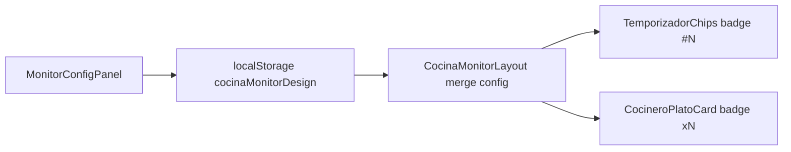

# Plan: Personalizar número secuencial de timers y badge de cantidad (×N)

**Versión:** 1.0  
**Fecha:** Julio 2026  
**Proyecto:** App Cocina (`appcocina`)  
**Estado:** Implementado (Julio 2026)  
**Relacionado con:**
- `PLAN_NUMERACION_GLOBAL_TEMPORIZADORES.md`
- `PLAN_PERSONALIZAR_VISTA_COCINA_TIPOGRAFIA_COLUMNAS.md`
- `PLAN_ORDEN_NUMERACION_ESPACIO_PLATOS_COMPLETO.md`

---

## 1. Resumen ejecutivo

En **Ver Cocina Completo** (y el panel **⚙ Personalizar** compartido), el cocinero/supervisor debe poder personalizar:

1. **Número secuencial global** de cada temporizador (`#1`, `#2`, …) — color, contorno, forma, tipografía, etc.  
   **Default:** color y contorno **verde**.
2. **Badge de cantidad de unidades** del plato (`×1`, `×2`, `×3`, `×4`…) — color, tamaño, contorno del cuadro.  
   **Default:** **blanco** (texto y contorno).

La persistencia sigue siendo `localStorage` → clave `cocinaMonitorDesign` (sin clave nueva).

---

## 2. Situación actual

| Elemento | Dónde se renderiza | Estilo hoy |
|----------|-------------------|------------|
| `#N` secuencial | `TemporizadorChips.jsx` → `renderBadgeNumero` | Usa `colorAcento` (dorado `#d4af37`); forma redondeada fija; tamaño derivado de `tamanioFuentePlato` |
| `×N` cantidad | `CocineroPlatoCard.jsx` (badge junto al nombre); también `PlatoMonitorRow.jsx` | Texto/borde `colorAcento` (o rojo si crítico); fondo `#0d0612`; radio `10px` |

No hay tokens dedicados en `DEFAULT_CONFIG` ni controles en `MonitorConfigPanel` para estos dos badges.

---

## 3. Defaults deseados

### 3.1 Número secuencial (`#N`)

| Token | Default | Notas |
|-------|---------|--------|
| `numeroSecColor` | `#22c55e` | Verde (texto) |
| `numeroSecContorno` | `#22c55e` | Verde (borde) |
| `numeroSecFondo` | `#22c55e22` | Verde semitransparente |
| `numeroSecForma` | `redondeado` | Ver §4.1 |
| `numeroSecTamanio` | `auto` | Si `auto`, sigue la fórmula actual (`tamanioFuentePlato * 0.55`); si número, px fijos |
| `numeroSecPeso` | `900` | |
| `numeroSecPrefijo` | `true` | Mostrar `#` delante |
| `numeroSecGlow` | `true` | Sombra suave del color |

En alerta crítica del timer: el fondo del chip de cronómetro sigue en rojo; el badge `#N` **mantiene** los colores personalizados (no hereda blanco/acento) para no perder identidad del número.

### 3.2 Cantidad (`×N`)

| Token | Default | Notas |
|-------|---------|--------|
| `cantidadColor` | `#ffffff` | Blanco (texto) |
| `cantidadContorno` | `#ffffff` | Blanco (borde) |
| `cantidadFondo` | `#0d0612` | Fondo oscuro legible (como hoy) |
| `cantidadTamanio` | `auto` | Si `auto` → `tamanioFuentePlato * 0.6`; si no, px |
| `cantidadGrosorContorno` | `2` | px |
| `cantidadRadio` | `10` | px; en modo `unido` → `4` |
| `cantidadPeso` | `900` | |

Si la tarjeta está en alerta crítica, **no** forzar rojo en el `×N` salvo que se active un flag opcional `cantidadSeguirAlerta` (default `false`) — prioridad: personalización blanca/legible.

---

## 4. Controles en Personalizar

Nueva sección en [`MonitorConfigPanel.jsx`](appcocina/src/components/monitor/MonitorConfigPanel.jsx):

**“Número secuencial (timers)”** y **“Cantidad (×N)”**, debajo de Diseño de lista / junto a Colores.

### 4.1 Número secuencial

| Control UI | Token | Opciones |
|------------|-------|----------|
| Color texto | `numeroSecColor` | `<input type="color">` |
| Color contorno | `numeroSecContorno` | color |
| Color fondo | `numeroSecFondo` | color (+ opcional opacidad 0–100 %) |
| Forma | `numeroSecForma` | `circulo` \| `redondeado` \| `cuadrado` \| `pildora` |
| Tamaño letra (px) | `numeroSecTamanio` | stepper + “Auto” |
| Peso | `numeroSecPeso` | 600 / 700 / 800 / 900 |
| Prefijo `#` | `numeroSecPrefijo` | checkbox |
| Glow | `numeroSecGlow` | checkbox |
| Mini preview | — | muestra `#1` `#2` `#12` en vivo |

Mapeo de forma → `borderRadius`:

| Forma | borderRadius |
|-------|--------------|
| `circulo` | `50%` |
| `redondeado` | `10px` (o `4px` si `espaciadoFilas === 'unido'`) |
| `cuadrado` | `0` |
| `pildora` | `999px` |

### 4.2 Cantidad ×N

| Control UI | Token | Opciones |
|------------|-------|----------|
| Color texto | `cantidadColor` | color — default blanco |
| Color contorno | `cantidadContorno` | color — default blanco |
| Color fondo | `cantidadFondo` | color |
| Tamaño (px) | `cantidadTamanio` | stepper + Auto |
| Grosor contorno | `cantidadGrosorContorno` | 1–4 |
| Radio cuadro | `cantidadRadio` | 0–20 |
| Mini preview | — | muestra `×1` `×2` `×4` |

---

## 5. Consumo en componentes

### 5.1 `TemporizadorChips.jsx`

`renderBadgeNumero` deja de usar `colorAcento` y lee:

```js
const color = configVisual.numeroSecColor || '#22c55e';
const borde = configVisual.numeroSecContorno || '#22c55e';
const fondo = configVisual.numeroSecFondo || '#22c55e22';
const forma = configVisual.numeroSecForma || 'redondeado';
// borderRadius según forma
// fontSize: numeroSecTamanio === 'auto' | null → fórmula actual
const texto = (configVisual.numeroSecPrefijo !== false ? '#' : '') + numero;
```

### 5.2 `CocineroPlatoCard.jsx`

Badge `×{cantidadTotal}`:

```js
color: configVisual.cantidadColor || '#ffffff',
border: `${grosor}px solid ${configVisual.cantidadContorno || '#ffffff'}`,
background: configVisual.cantidadFondo || '#0d0612',
fontSize: …,
borderRadius: …
```

### 5.3 `PlatoMonitorRow.jsx`

El `×{cantidadTotal}` inline debe usar los mismos tokens para no divergir en vistas legacy del monitor.

### 5.4 Defaults en `CocinaMonitorLayout.jsx`

Ampliar `DEFAULT_CONFIG` con todos los tokens de §3 (para que “Restaurar valores por defecto” vuelva a verde / blanco).

---

## 6. Preview en el panel

En el bloque de preview existente (o mini-fila bajo las nuevas secciones):

```
[ #1 ]  [ #2 ]     ← estilo numeroSec*
[ ×1 ]  [ ×2 ]  [ ×4 ]  ← estilo cantidad*
```

Así el usuario ve el cambio sin cerrar Personalizar.

---

## 7. Archivos a tocar

| Archivo | Cambio |
|---------|--------|
| `CocinaMonitorLayout.jsx` | Tokens en `DEFAULT_CONFIG` |
| `MonitorConfigPanel.jsx` | Secciones UI + preview |
| `TemporizadorChips.jsx` | Aplicar tokens al badge `#N` |
| `CocineroPlatoCard.jsx` | Aplicar tokens al `×N` |
| `PlatoMonitorRow.jsx` | Mismos tokens en `×N` |
| Doc | Este archivo; marcar Implementado al cerrar |

Opcional (limpieza): helper `appcocina/src/utils/monitorBadgeStyles.js` con `estiloNumeroSecuencial(config)` y `estiloCantidadBadge(config)` para no duplicar lógica.

---

## 8. Flujo



---

## 9. Criterios de aceptación

1. Con config por defecto (o tras “Restaurar”): `#N` verde (texto + contorno); `×N` blanco (texto + contorno).
2. Cambiar color/forma/tamaño del número secuencial se ve al instante en timers.
3. Cambiar color/tamaño/contorno del `×N` se ve en la tarjeta.
4. Preferencias persisten al recargar (misma clave `cocinaMonitorDesign`).
5. Modo `unido` no rompe formas (círculo/píldora siguen coherentes; redondeado puede bajar a 4px).
6. Animaciones de tarjetas y numeración global existentes sin regresiones.

---

## 10. Fuera de alcance

- Cambiar el color de **contorno del chip del cronómetro** (`colorLinea` por comanda) — ya tiene su lógica; este plan solo personaliza el badge `#N` y el `×N`.
- Personalizar números locales antiguos `1-` (ya reemplazados por `#N` global).
- Finalización por unidad en backend.

---

## 11. Orden de implementación

1. Añadir tokens + defaults en `DEFAULT_CONFIG`.
2. Controles + preview en `MonitorConfigPanel`.
3. Consumir en `TemporizadorChips` (número verde).
4. Consumir en `CocineroPlatoCard` + `PlatoMonitorRow` (cantidad blanca).
5. Probar Personalizar / Restaurar / persistencia / modo unido.
