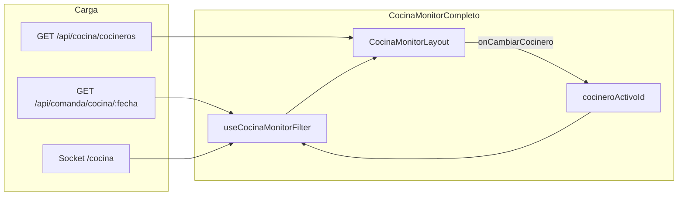

# Plan: Selector de cocineros en Ver Cocina Completo

**Versión:** 1.0  
**Fecha:** Julio 2026  
**Proyecto:** App Cocina (`appcocina`) + Backend (`backend-gambusinas`)  
**Estado:** Planificación — sin implementar  
**Relacionado con:** `PLAN_VISTA_VER_COCINA.md` (monitor pasivo general)

---

## Resumen ejecutivo

En la vista **Ver Cocina Completo** se agregará un **selector de cocineros** en la barra superior. Permite filtrar los platos mostrados según el cocinero que los tomó (`procesandoPor`).

| Modo selector | Comportamiento |
|---------------|----------------|
| **General** (default) | Muestra todos los platos tomados por cualquier cocinero |
| **Por cocinero** | Muestra solo platos donde `procesandoPor.cocineroId` coincide con el cocinero seleccionado |

### Ejemplo operativo

```
Turno activo:
  - Cocinero 1 (Juan): 20 platos tomados
  - Cocinero 2 (María): 10 platos tomados
  - Cocinero 3 (Pedro): 0 platos tomados

Selector en barra superior:
  [ General ]  [ Juan ]  [ María ]  [ Pedro ]

  General  → 30 platos visibles (20 + 10)
  Juan     → 20 platos
  María    → 10 platos
  Pedro    → empty state ("Sin platos para Pedro")
```

El encargado o supervisor usa **General** para el panorama del turno. Un cocinero puede abrir la misma vista y elegir su nombre para ver solo su carga de trabajo.

---

## 1. Contexto — qué existe hoy

### 1.1 Vista Ver Cocina Completo

| Aspecto | Estado actual |
|---------|---------------|
| Componente | `CocinaMonitorCompleto.jsx` |
| Layout compartido | `CocinaMonitorLayout.jsx` |
| Filtro de platos | `useCocinaMonitorFilter.js` |
| Filtro por Vista de Cocina | **No aplica** (`vistaCocina = null`) |
| Filtro por cocinero | **No existe** |
| Selector en barra superior | Solo en Personalizado (pills de `VistaCocina`) |

### 1.2 Criterio de visibilidad actual

Un plato aparece en Ver Cocina si:

1. `estado` ∈ `['pedido', 'en_espera']`
2. No está anulado ni eliminado
3. Tiene `procesandoPor.cocineroId` (fue tomado por un cocinero)

La asignación ocurre en el KDS (Vista General, Personalizada o Supervisor) vía `PUT /api/comanda/:id/plato/:platoId/procesando`.

### 1.3 Datos del cocinero en cada plato

```javascript
// comanda.model.js — cada plato
procesandoPor: {
  cocineroId: ObjectId,  // ref mozos
  nombre: String,
  alias: String,
  timestamp: Date
}
```

El filtro por cocinero usará **`procesandoPor.cocineroId`** como fuente de verdad.

---

## 2. Requisito funcional

### 2.1 Ubicación UI

El selector va en la **barra superior** de `CocinaMonitorLayout`, visible solo en **Ver Cocina Completo** (no en Personalizado ni en modo fijo de TVs).

```
┌──────────────────────────────────────────────────────────────────────────────┐
│  🍳 VER COCINA — COMPLETO          Pendientes: 20    Urgentes: 3    14:32:05 │
├──────────────────────────────────────────────────────────────────────────────┤
│  Cocinero:  [ General ]  [ Juan ]  [ María ]  [ Pedro ]          ⚙ Personalizar │
├──────────────────────────────────────────────────────────────────────────────┤
│  LOMO SALTADO ×3                                    Mesa 12      ⏱ 08:45   │
│  👨‍🍳 Juan                                                                   │
├──────────────────────────────────────────────────────────────────────────────┤
│  ...                                                                         │
└──────────────────────────────────────────────────────────────────────────────┘
```

**Posición recomendada:** segunda fila del header (debajo del título), similar a los pills de vista en `CocinaMonitorPersonalizado`, o integrada en la primera fila si hay espacio en monitor de PC (no TV).

### 2.2 Opciones del selector

| Opción | Valor interno | Origen |
|--------|---------------|--------|
| **General** | `null` o `'general'` | Siempre presente, seleccionada por default |
| **Cocinero N** | `cocinero._id` | `GET /api/cocina/cocineros` (ver §4) |

Reglas:

- Listar **todos los cocineros activos** del sistema (`rol: 'cocinero'`, `activo !== false`).
- El número de opciones depende de cuántos usuarios cocineros existan (dinámico).
- Orden sugerido: alfabético por `alias` o `name`.
- Mostrar **alias** si existe; si no, **name**.
- Opcional: badge con cantidad de platos del cocinero en el turno actual.

### 2.3 Comportamiento del filtro

Al seleccionar un cocinero:

1. Antes de agrupar, excluir platos cuyo `procesandoPor.cocineroId` no coincida.
2. Recalcular `cantidadTotal` por grupo solo con platos del cocinero filtrado.
3. Actualizar contador **Pendientes** del header con el total filtrado.
4. Si un grupo tenía platos de Juan y María y se filtra por Juan, el grupo muestra solo la cantidad de Juan.

Al volver a **General**, se restaura la vista completa.

### 2.4 Persistencia de selección

| Clave localStorage | Valor | Alcance |
|--------------------|-------|---------|
| `cocinaMonitorCocineroId` | `null` \| `_id` del cocinero | Solo Ver Cocina Completo |

- Restaurar al reabrir la vista en la misma sesión/PC.
- Default si no hay valor guardado: **General**.
- En **modo fijo** (TVs): no mostrar selector (igual que otros controles).

### 2.5 Permisos

| Permiso | Acceso |
|---------|--------|
| `ver-cocina-completo` | Ver la vista y usar el selector |

No se requiere permiso adicional. Cualquier usuario con acceso a Ver Cocina Completo puede filtrar por cualquier cocinero (solo lectura).

---

## 3. Diseño técnico — frontend

### 3.1 Archivos a modificar / crear

```
appcocina/src/
├── components/monitor/
│   ├── CocinaMonitorCompleto.jsx      ← estado cocinero + carga lista
│   └── CocinaMonitorLayout.jsx        ← UI selector (props nuevas)
├── hooks/
│   ├── useCocinaMonitorFilter.js      ← parámetro cocineroIdFiltrado
│   └── useCocinerosLista.js           ← NUEVO: fetch cocineros activos
└── components/monitor/
    └── CocineroSelectorBar.jsx        ← NUEVO (opcional, pills reutilizables)
```

### 3.2 Hook `useCocinerosLista` (nuevo)

Responsabilidad: cargar cocineros activos una vez al montar `CocinaMonitorCompleto`.

```javascript
// useCocinerosLista.js
const useCocinerosLista = ({ getToken }) => {
  const [cocineros, setCocineros] = useState([]);
  const [loading, setLoading] = useState(true);
  const [error, setError] = useState(null);

  // GET /api/cocina/cocineros
  // Retorna: [{ _id, name, alias, activo }]

  return { cocineros, loading, error, recargar };
};
```

Reutilizar patrón de `useAsignacionCocinero.cargarCocineros`, pero con endpoint dedicado para la app cocina (ver §4).

### 3.3 Cambio en `useCocinaMonitorFilter`

Agregar cuarto parámetro opcional `opciones`:

```javascript
const useCocinaMonitorFilter = (
  comandas,
  vistaCocina = null,
  ordenamiento = null,
  opciones = {}
) => {
  const { cocineroIdFiltrado = null } = opciones;
  // ...
};
```

Nueva función auxiliar:

```javascript
function platoAsignadoACocinero(plato, cocineroIdFiltrado) {
  if (!cocineroIdFiltrado) return true; // General
  const id = plato.procesandoPor?.cocineroId;
  if (!id) return false;
  return String(id) === String(cocineroIdFiltrado);
}
```

Insertar en el pipeline (paso 1, antes de agrupar):

```javascript
if (!platoAsignadoACocinero(plato, cocineroIdFiltrado)) continue;
```

**Importante:** el filtro por cocinero es **independiente** del filtro por `VistaCocina`. En Completo, `vistaCocina` sigue siendo `null`; solo aplica `cocineroIdFiltrado`.

### 3.4 Cambio en `CocinaMonitorCompleto`

```javascript
const STORAGE_COCINERO_KEY = 'cocinaMonitorCocineroId';

const [cocineroActivoId, setCocineroActivoId] = useState(() => {
  const saved = localStorage.getItem(STORAGE_COCINERO_KEY);
  return saved === 'general' || !saved ? null : saved;
});

const { cocineros, loading: loadingCocineros } = useCocinerosLista({ getToken });

const platosPendientes = useCocinaMonitorFilter(comandas, null, ordenamiento, {
  cocineroIdFiltrado: cocineroActivoId,
});

const cambiarCocinero = (id) => {
  setCocineroActivoId(id);
  localStorage.setItem(STORAGE_COCINERO_KEY, id ?? 'general');
};

// Pasar a CocinaMonitorLayout:
// cocineros, cocineroActivoId, onCambiarCocinero, loadingCocineros
```

### 3.5 Cambio en `CocinaMonitorLayout`

Nuevas props:

| Prop | Tipo | Descripción |
|------|------|-------------|
| `cocineros` | `Array` | Lista de cocineros (solo Completo) |
| `cocineroActivoId` | `string \| null` | `null` = General |
| `onCambiarCocinero` | `Function` | Callback al seleccionar |
| `loadingCocineros` | `boolean` | Estado de carga |

Renderizar barra de pills solo si `cocineros != null && !modoFijo`:

```jsx
{cocineros && !modoFijo && (
  <CocineroSelectorBar
    cocineros={cocineros}
    activoId={cocineroActivoId}
    onChange={onCambiarCocinero}
    loading={loadingCocineros}
    conteosPorCocinero={conteosPorCocinero}  // opcional fase 2
    colorAcento={colorAcento}
    ...
  />
)}
```

**Estilo:** reutilizar el patrón visual de los pills de `VistaCocina` (líneas 319–349 de `CocinaMonitorLayout.jsx`) para consistencia.

### 3.6 Título dinámico del header

Cuando hay cocinero seleccionado, el título puede reflejar el filtro:

| Selección | Título header |
|-----------|---------------|
| General | `VER COCINA — COMPLETO` |
| Juan | `VER COCINA — JUAN` (o alias) |

Alternativa: mantener título fijo y resaltar el pill activo. **Recomendación:** título fijo + pill activo (menos confusión al cambiar rápido).

### 3.7 Empty state contextual

`MonitorEmptyState.jsx` debe aceptar mensaje opcional:

| Contexto | Mensaje |
|----------|---------|
| General, sin platos | "No hay platos tomados pendientes de preparación" |
| Cocinero X, sin platos | "Juan no tiene platos pendientes en este momento ✓" |
| Cocinero sin platos asignados hoy | Igual que arriba |

### 3.8 Badge de conteo por cocinero (fase 2 — opcional)

Calcular en `CocinaMonitorCompleto` a partir de comandas sin agrupar:

```javascript
const conteosPorCocinero = useMemo(() => {
  const map = new Map();
  // recorrer platos tomados y sumar cantidades por cocineroId
  return map;
}, [comandas]);
```

Mostrar en cada pill: `Juan (20)`. Ayuda al encargado sin abrir cada filtro.

---

## 4. Diseño técnico — backend

### 4.1 Problema de permisos

`GET /api/cocineros` actual requiere `ver-mozos` (permiso de dashboard). El rol **cocinero** tiene `ver-cocina-completo` pero **no** `ver-mozos`.

Por eso **no** reutilizar directamente `GET /api/cocineros` para todos los usuarios de la app cocina.

### 4.2 Nuevo endpoint recomendado

```
GET /api/cocina/cocineros
Authorization: Bearer <token app cocina>
Permiso: ver-cocina-completo
```

**Respuesta mínima (sin datos sensibles):**

```json
{
  "success": true,
  "data": [
    { "_id": "abc123", "name": "Juan Pérez", "alias": "Juan" },
    { "_id": "def456", "name": "María López", "alias": "María" }
  ],
  "total": 2
}
```

**Implementación:**

- Archivo: `backend-gambusinas/src/controllers/cocinaController.js` (nuevo) o extensión de `cocinerosController.js`
- Reutilizar `cocinerosRepository.obtenerCocineros({ activo: true })`
- Proyección: solo `_id`, `name`, `alias` (campo `name` del modelo `mozos`)
- Auth: middleware existente para tokens JWT con `app: 'cocina'`
- Permiso: `checkPermission('ver-cocina-completo')`

### 4.3 Alternativa sin nuevo endpoint

Derivar cocineros únicos de `procesandoPor` en las comandas del día:

- **Pros:** sin cambio backend, sin permisos extra
- **Contras:** no lista cocineros con 0 platos; nombres pueden desincronizarse si cambian en admin

**No recomendado** como solución principal porque el selector debe mostrar todos los cocineros del turno, aunque no tengan platos asignados aún.

---

## 5. Casos borde

| Caso | Comportamiento esperado |
|------|-------------------------|
| Grupo con platos de 2 cocineros | Al filtrar por uno, cantidad = solo sus platos del grupo |
| Cocinero desactivado en admin | Desaparece del selector en próxima carga; si estaba seleccionado → volver a General |
| Cocinero seleccionado libera todos sus platos | Lista vacía + empty state |
| Socket actualiza `procesandoPor` | Filtro reactivo vía `useMemo` en el hook |
| 0 cocineros en sistema | Solo pill "General"; sin error |
| 1 cocinero en sistema | General + 1 pill |
| Cocinero recién creado | Aparece tras recargar lista o al remontar vista |
| Comparación de IDs | Siempre `String(id)` — Mongo ObjectId vs string |
| Modo fijo (TV) | Sin selector; siempre General |

---

## 6. Flujo de datos



---

## 7. Fases de implementación

### Fase 1 — MVP (P0)

| # | Tarea | Archivo(s) |
|---|-------|------------|
| 1 | Endpoint `GET /api/cocina/cocineros` | `cocinaController.js`, rutas |
| 2 | Hook `useCocinerosLista` | `hooks/useCocinerosLista.js` |
| 3 | Filtro `cocineroIdFiltrado` en `useCocinaMonitorFilter` | `useCocinaMonitorFilter.js` |
| 4 | Estado + persistencia en `CocinaMonitorCompleto` | `CocinaMonitorCompleto.jsx` |
| 5 | UI selector pills en layout | `CocinaMonitorLayout.jsx` |
| 6 | Empty state contextual | `MonitorEmptyState.jsx` |

### Fase 2 — Pulido (P1)

| # | Tarea |
|---|-------|
| 7 | Badge de conteo por cocinero en cada pill |
| 8 | Ordenar pills: cocineros con platos primero |
| 9 | Atajo teclado `1` = General, `2–9` = cocineros (opcional) |
| 10 | Tests unitarios `platoAsignadoACocinero` + agrupación filtrada |

### Fase 3 — Fuera de alcance inicial

| # | Tarea | Notas |
|---|-------|-------|
| 11 | Selector en Ver Cocina Personalizado | Solo si se pide; Personalizado ya filtra por estación |
| 12 | Selector en modo fijo TV | No; TVs muestran vista de estación, no por persona |
| 13 | Multi-selección de cocineros | No en v1; solo uno o General |

---

## 8. Criterios de aceptación

### Funcional

- [ ] Al abrir Ver Cocina Completo, el selector muestra **General** seleccionado por default
- [ ] **General** muestra todos los platos tomados (comportamiento actual sin regresión)
- [ ] Al seleccionar un cocinero, solo aparecen platos con `procesandoPor.cocineroId` coincidente
- [ ] El contador **Pendientes** refleja el total filtrado
- [ ] Al cambiar de cocinero, la lista actualiza en menos de 1 s (sin nueva petición HTTP)
- [ ] La selección persiste al volver al menú y reentrar a Ver Cocina Completo
- [ ] Cocinero sin platos muestra empty state con su nombre
- [ ] En modo fijo no aparece el selector

### Lista de cocineros

- [ ] El selector lista todos los cocineros activos del sistema
- [ ] Si hay 3 cocineros, aparecen 4 pills: General + 3 nombres
- [ ] Usuario con solo `ver-cocina-completo` puede cargar la lista (sin `ver-mozos`)

### Tiempo real

- [ ] Si el supervisor reasigna un plato a otro cocinero, el plato desaparece del filtro anterior y aparece en el nuevo al recibir el evento socket

### Regresión

- [ ] Ver Cocina Personalizado no muestra selector de cocineros
- [ ] Agrupación por nombre + complementos sigue funcionando con filtro activo

---

## 9. Wireframe comparativo

### Antes (actual)

```
Header:  [🍳 VER COCINA — COMPLETO]     Pendientes | Urgentes | Hora | ⚙
Lista:   todos los platos tomados
```

### Después (propuesto)

```
Header:  [🍳 VER COCINA — COMPLETO]     Pendientes | Urgentes | Hora | ⚙
Barra:   Cocinero: [General*] [Juan] [María] [Pedro]
Lista:   platos filtrados según selección
```

`*` = pill activo (fondo acento dorado, mismo estilo que vistas personalizadas)

---

## 10. Referencias en el codebase

| Recurso | Ruta |
|---------|------|
| Monitor completo | `appcocina/src/components/monitor/CocinaMonitorCompleto.jsx` |
| Layout + pills referencia | `appcocina/src/components/monitor/CocinaMonitorLayout.jsx` |
| Filtro actual | `appcocina/src/hooks/useCocinaMonitorFilter.js` |
| Carga cocineros (supervisor) | `appcocina/src/hooks/useAsignacionCocinero.js` |
| Modelo plato | `backend-gambusinas/src/database/models/comanda.model.js` |
| Repo cocineros | `backend-gambusinas/src/repository/cocineros.repository.js` |
| Permisos | `backend-gambusinas/src/database/models/roles.model.js` |
| Plan monitor general | `appcocina/docs/PLAN_VISTA_VER_COCINA.md` |

---

## 11. Glosario

| Término | Significado |
|---------|-------------|
| **General** | Vista sin filtro por cocinero; todos los platos tomados |
| **procesandoPor** | Campo del plato que indica qué cocinero lo tomó |
| **Tomar plato** | Acción en KDS que setea `procesandoPor` |
| **Pill** | Botón redondeado del selector (estilo chips) |

---

*Documento v1.0 — listo para revisión e implementación Fase 1.*
