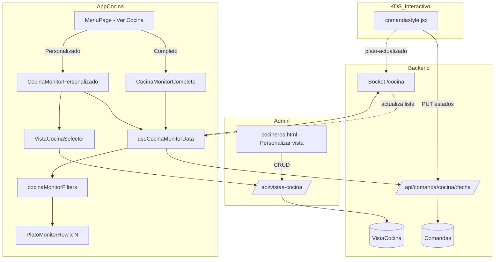

# Plan: Vista "Ver Cocina" — Monitor pasivo para cocineros

**Versión:** 1.0  
**Fecha:** Junio 2026  
**Proyecto:** App Cocina (`appcocina`) + Admin (`cocineros.html`) + Backend  
**Estado:** Planificación — sin implementar

---

## Resumen ejecutivo

Se agregará una nueva funcionalidad **"Ver Cocina"** en el menú principal de la App de Cocina. A diferencia de **"Ver Comandas"** (KDS interactivo), esta vista es **solo lectura**: los cocineros ven qué platos deben preparar, sin poder cambiar estados, tomar platos ni finalizar comandas.

La funcionalidad se divide en dos modos:

| Modo | Propósito |
|------|-----------|
| **Ver Cocina Completo** | Lista plana de todos los platos pendientes de preparación del día |
| **Ver Cocina Personalizado** | Igual que el completo, pero filtrado por una **Vista de Cocina** creada en el admin |

La personalización visual (fuentes, tamaños, colores) y la definición de vistas por plato se gestionan desde **`cocineros.html`**, en una nueva sección **"Personalizar vista"** junto a la pestaña **"Zonas"**.

---

## 1. Contexto y diferencia con el KDS actual

### 1.1 Qué existe hoy

| Funcionalidad | Ubicación | Naturaleza |
|---------------|-----------|------------|
| Ver Comandas | `MenuPage.jsx` → `comandastyle.jsx` | Interactivo: tomar, finalizar, entregar |
| Vista Personalizada (KDS) | `ComandastylePerso.jsx` | Interactivo + filtro por **Zonas** del cocinero |
| Vista Supervisor | `ComandaStyleSupervi.jsx` | Interactivo + asignación de cocineros |
| Zonas | `cocineros.html` + `zona.model.js` | Filtros para el tablero KDS asignados a cocineros |

### 1.2 Qué se construye

```
┌─────────────────────────────────────────────────────────────────────────┐
│                         MENÚ PRINCIPAL (MenuPage)                        │
├─────────────────────────────────────────────────────────────────────────┤
│  Ver Comandas          → KDS interactivo (sin cambios)                   │
│  Ver Cocina      ← NUEVO → Monitor pasivo (solo visualización)          │
│  Tabla PPA / Configuración                                               │
└─────────────────────────────────────────────────────────────────────────┘
                              │
                              ▼
                    ┌─────────────────────┐
                    │  Modal selector     │
                    ├─────────────────────┤
                    │ Ver Cocina Completo │
                    │ Ver Cocina Personal.│
                    └─────────────────────┘
```

### 1.3 Principio rector

> **La vista Ver Cocina observa el mismo flujo de datos que el KDS, pero nunca escribe en el backend.**  
> No llama a `PUT /procesando`, `PUT /estado`, `PUT /finalizar` ni modifica `platoStates` locales.

---

## 2. Estados de plato — criterio de visibilidad

### 2.1 Mapeo de estados (referencia del sistema)

| Etiqueta de negocio | Estado backend | Sección en KDS | ¿Visible en Ver Cocina? |
|---------------------|----------------|----------------|-------------------------|
| En cola / esperando | `pedido`, `en_espera` | EN PREPARACIÓN | **Sí** |
| Procesando (UI) | `procesandoPor` set (sin cambio de `estado`) | EN PREPARACIÓN + badge | **Sí** |
| Listo para recoger | `recoger` | PREPARADOS | **No** — desaparece |
| Salió de cocina | `salio` | — | No |
| Entregado / pagado | `entregado`, `pagado` | — | No |

### 2.2 Regla de filtrado (Ver Cocina Completo)

Un plato **aparece** en la lista si:

```javascript
plato.estado ∈ ['pedido', 'en_espera']
// y no está anulado/eliminado
```

Un plato **desaparece** automáticamente cuando:

```javascript
plato.estado === 'recoger'  // "Listo para recoger"
// o estados posteriores: salio, entregado, pagado
```

**Nota sobre "Procesando":** En el KDS, "Procesando" es un estado **visual local** (`platoStates`) que acompaña a `procesandoPor` en el backend. En Ver Cocina no se replica ese ciclo de clicks; el plato sigue visible mientras su `estado` backend sea `pedido` o `en_espera`, independientemente de si otro cocinero lo marcó como tomado en el KDS. Opcionalmente se puede mostrar un indicador visual si `procesandoPor` existe (recomendado).

### 2.3 Actualización en tiempo real

Reutilizar la infraestructura existente:

- **Carga inicial:** `GET /api/comanda/cocina/:fecha`
- **Sockets:** namespace `/cocina`, eventos `plato-actualizado`, `plato-actualizado-batch`, `comanda-actualizada`, `nueva-comanda`
- **Hook base:** extraer lógica de `useComandastyleCore.js` en un hook compartido `useCocinaMonitorData.js` (solo lectura)

---

## 3. Navegación y rutas (App Cocina)

### 3.1 Cambios en `MenuPage.jsx`

Agregar en `mainOptions` (junto a "Ver Comandas"):

```javascript
{
  id: 'ver-cocina',
  title: 'Ver Cocina',
  subtitle: 'Monitor de platos por preparar',
  icon: FaTv, // o FaDesktop / FaEye
  color: 'from-amber-500 to-orange-600',
  shadowColor: 'shadow-amber-500/30',
  action: () => setShowCocinaViewSelector(true),
  enabled: true,
}
```

Modal de selección (análogo al de Ver Comandas):

| Opción | ID | Navega a |
|--------|-----|----------|
| Ver Cocina Completo | `completo` | `VER_COCINA_COMPLETO` |
| Ver Cocina Personalizado | `personalizado` | `VER_COCINA_PERSONALIZADO` |

### 3.2 Cambios en `App.jsx`

Nuevas vistas en el router:

```javascript
// Vistas existentes: LOGIN | MENU | COCINA | COCINA_PERSONALIZADA | COCINA_SUPERVISOR | TICKETS_PPA
// Nuevas:
// VER_COCINA_COMPLETO      → CocinaMonitorCompleto.jsx
// VER_COCINA_PERSONALIZADO → CocinaMonitorPersonalizado.jsx
```

Persistencia en `localStorage`:

| Clave | Valor |
|-------|-------|
| `cocinaLastView` | Incluir las dos nuevas vistas |
| `cocinaMonitorMode` | `'completo'` \| `'personalizado'` |
| `cocinaMonitorVistaId` | ID de la Vista de Cocina activa (modo personalizado) |

### 3.3 Permisos (opcional, fase 2)

| Permiso | Descripción |
|---------|-------------|
| `ver-cocina-completo` | Acceso al monitor completo |
| `ver-cocina-personalizado` | Acceso al monitor filtrado |
| `administrar-vistas-cocina` | CRUD en `cocineros.html` (admin/supervisor) |

Por defecto en fase 1: cualquier cocinero autenticado puede ver ambos modos.

---

## 4. Diseño de la vista — Ver Cocina Completo

### 4.1 Layout propuesto

Vista **sin tarjetas de comanda** — lista agregada de platos, optimizada para lectura a distancia en pantalla de cocina.

```
┌──────────────────────────────────────────────────────────────────────────┐
│  🍳 VER COCINA — COMPLETO          [⚙ Apariencia]  [◀ Menú]  14:32:05  │
├──────────────────────────────────────────────────────────────────────────┤
│  Pendientes: 12 platos    │  Más antiguo: 08:45    │  Urgentes: 2       │
├──────────────────────────────────────────────────────────────────────────┤
│                                                                          │
│  ┌────────────────────────────────────────────────────────────────────┐  │
│  │ LOMO SALTADO ×2          Mesa 14 · Comanda #1284        ⏱ 12:34   │  │
│  │ Sin cebolla · Poco picante                              🔴 URGENTE │  │
│  └────────────────────────────────────────────────────────────────────┘  │
│  ┌────────────────────────────────────────────────────────────────────┐  │
│  │ AJÍ DE GALLINA ×1        Para llevar · #1290            ⏱ 08:12   │  │
│  │ 👨‍🍳 Juan (tomado)                                      🟡 Alerta  │  │
│  └────────────────────────────────────────────────────────────────────┘  │
│  ...                                                                     │
└──────────────────────────────────────────────────────────────────────────┘
```

### 4.2 Campos por fila de plato (información mínima para el cocinero)

| Campo | Fuente de datos | Prioridad |
|-------|-----------------|-----------|
| **Nombre del plato** | `plato.nombre` | Obligatorio |
| **Cantidad** | `plato.cantidad` | Obligatorio |
| **Cronómetro** | `plato.tiempos.en_espera` o `plato.tiempos.pedido` | Obligatorio |
| **Mesa / área** | `comanda.mesa`, `comanda.area` | Recomendado |
| **Nº comanda** | `comanda.numero` o ticket | Recomendado |
| **Complementos / notas** | `plato.complementos`, `plato.observaciones` | Si existen |
| **Tipo servicio** | `mesa` / `para_llevar` | Recomendado |
| **Prioridad** | `comanda.prioridadOrden` | Si es urgente |
| **Cocinero que lo tomó** | `plato.procesandoPor.alias` | Opcional (configurable) |
| **Código de búsqueda** | `plato.codigoSerie` | Opcional |

### 4.3 Cronómetro

Reutilizar la lógica de alertas del KDS (`configTableroKDS.tiempoAmarillo`, `tiempoRojo`):

| Tiempo transcurrido | Indicador visual |
|---------------------|------------------|
| &lt; amarillo | Normal (color base) |
| ≥ amarillo | Borde/fondo amarillo |
| ≥ rojo | Borde/fondo rojo + pulso suave |

El tiempo se calcula desde el timestamp del estado actual (`tiempos.en_espera` preferido sobre `tiempos.pedido`).

### 4.4 Ordenamiento recomendado (por defecto)

1. Comandas prioritarias / urgentes primero  
2. Tiempo de espera descendente (más antiguo arriba)  
3. Alfabético por nombre de plato (desempate)

Configurable en fase 2: por mesa, por área, por categoría.

### 4.5 Interacciones permitidas (solo lectura)

| Acción | Permitida |
|--------|-----------|
| Ver lista de platos | Sí |
| Cambiar apariencia (local) | Sí |
| Volver al menú | Sí |
| Pantalla completa (F11 / botón) | Sí |
| Click en plato para cambiar estado | **No** |
| Tomar / finalizar / entregar | **No** |
| Buscar plato por código | Opcional (solo resalta, no actúa) |

---

## 5. Personalización visual

### 5.1 Opciones configurables

Extender o crear un contexto dedicado `VistaCocinaConfigContext` (separado del KDS interactivo para no mezclar perfiles):

| Parámetro | Tipo | Default sugerido |
|-----------|------|------------------|
| `fuenteFamilia` | select | `'Inter, system-ui, sans-serif'` |
| `tamanioFuentePlato` | number (px) | `28` |
| `tamanioFuenteDetalle` | number (px) | `18` |
| `tamanioFuenteCronometro` | number (px) | `24` |
| `colorFondo` | hex | `#0a0a0f` |
| `colorTextoPrincipal` | hex | `#ffffff` |
| `colorTextoSecundario` | hex | `#9ca3af` |
| `colorAcento` | hex | `#d4af37` (gold Gambusinas) |
| `colorAlertaAmarilla` | hex | `#fbbf24` |
| `colorAlertaRoja` | hex | `#ef4444` |
| `colorFilaPlato` | hex | `#1a1a28` |
| `espaciadoFilas` | `'compacto' \| 'normal' \| 'amplio'` | `'normal'` |
| `mostrarCocineroTomado` | boolean | `true` |
| `mostrarComplementos` | boolean | `true` |
| `modoAltoContraste` | boolean | `false` |
| `modoNocturno` | boolean | `true` |

Fuentes sugeridas en el selector: Inter, Arial, Roboto, Oswald, Bebas Neue (legibles a distancia).

### 5.2 Dónde se guarda la configuración

| Alcance | Almacenamiento | Uso |
|---------|----------------|-----|
| Por dispositivo (rápido) | `localStorage` → `cocinaMonitorDesign` | Ajuste en pantalla sin login admin |
| Por Vista de Cocina (persistente) | Backend → `VistaCocina.configVisual` | Pantallas fijas de estación |
| Global del restaurante | `configuracionSistema` (opcional) | Default para nuevas vistas |

### 5.3 Modal "Apariencia" en la vista

Botón ⚙ en el header que abre un panel lateral (no el `ConfigModal` del KDS) con preview en vivo. Los cambios se aplican instantáneamente.

---

## 6. Ver Cocina Personalizado

### 6.1 Concepto: Vista de Cocina (nueva entidad)

Las **Zonas** actuales filtran el KDS interactivo y se asignan a cocineros. Las **Vistas de Cocina** son un concepto distinto: presets de **monitor pasivo** por estación física (ej. "Criolla", "Parrilla", "Postres").

| Aspecto | Zona (existente) | Vista de Cocina (nueva) |
|---------|------------------|-------------------------|
| Uso principal | KDS interactivo del cocinero | Monitor de pared / tablet fija |
| Asignación | Por cocinero (`zonasAsignadas`) | Por pantalla / selección manual |
| Filtro | Platos + comandas + horario | **Solo platos** (lista plana) |
| Interacción | Control total | Solo lectura |
| Config visual | `configTableroKDS` del cocinero | `configVisual` propio de la vista |

### 6.2 Modelo de datos propuesto — `VistaCocina`

**Archivo:** `backend-gambusinas/src/database/models/vistaCocina.model.js`

```javascript
{
  nombre: String,           // "Criolla", "Parrilla", "Bar"
  descripcion: String,
  color: String,            // Identificación visual en selector
  icono: String,
  activo: Boolean,

  filtrosPlatos: {
    modoInclusion: Boolean, // true = solo estos, false = todos excepto estos
    platosPermitidos: [Number],      // platoId
    categoriasPermitidas: [String],
    tiposPermitidos: [String]        // slugs tipos_plato
  },

  configVisual: {
    fuenteFamilia, tamanioFuentePlato, tamanioFuenteDetalle,
    tamanioFuenteCronometro, colorFondo, colorTextoPrincipal,
    colorAcento, colorAlertaAmarilla, colorAlertaRoja,
    espaciadoFilas, mostrarCocineroTomado, mostrarComplementos,
    modoAltoContraste, modoNocturno
  },

  ordenamiento: {
    criterio: 'tiempo' | 'prioridad' | 'mesa' | 'alfabetico',
    direccion: 'asc' | 'desc'
  },

  creadoPor, actualizadoPor, timestamps
}
```

### 6.3 API REST propuesta

| Método | Endpoint | Descripción |
|--------|----------|-------------|
| GET | `/api/vistas-cocina` | Listar vistas activas |
| GET | `/api/vistas-cocina/:id` | Detalle + config visual |
| POST | `/api/vistas-cocina` | Crear vista |
| PUT | `/api/vistas-cocina/:id` | Actualizar |
| DELETE | `/api/vistas-cocina/:id` | Eliminar (soft delete) |
| PATCH | `/api/vistas-cocina/:id/reactivar` | Reactivar |

### 6.4 Flujo en App Cocina — modo personalizado

```
Usuario elige "Ver Cocina Personalizado"
        │
        ▼
GET /api/vistas-cocina  →  Si hay vistas:
        │                    Mostrar selector de vista (chips: Criolla, Parrilla...)
        │                    Recordar última en localStorage
        ▼
CocinaMonitorPersonalizado.jsx
        │
        ├─ Aplica filtrosPlatos de la vista seleccionada
        ├─ Aplica configVisual de la vista (con override local opcional)
        └─ Selector en header para cambiar de vista sin volver al menú
```

Ejemplo de uso real:

- Vista **"Criolla"**: 5 platos (Ají de gallina, Seco, Tacu tacu, …)  
- Vista **"Internacional"**: 10 platos (Lomo saltado, Tallarines, …)  
- Cada pantalla en la cocina abre la vista que le corresponde.

### 6.5 Cambiar vista desde el monitor

En el header del modo personalizado:

```
[ Criolla ▼ ]  [ Parrilla ]  [ Postres ]  [ ⚙ ]  [ ◀ Menú ]
```

Al cambiar vista: recarga filtros + config visual + guarda preferencia en `localStorage`.

---

## 7. Admin — `cocineros.html`: "Personalizar vista"

### 7.1 Ubicación en la UI

Agregar una **tercera pestaña** en `cocineros.html` (junto a Cocineros y Zonas):

```
[ Cocineros ]  [ Zonas ]  [ Personalizar vista ]  ← NUEVO
```

### 7.2 Funcionalidades del tab

| Función | Descripción |
|---------|-------------|
| Listar vistas | Tabla con nombre, # platos, color, activo |
| Crear vista | Modal: nombre, icono, color, selección de platos |
| Editar filtros | Multi-select de platos / categorías / tipos (reutilizar UI de Zonas) |
| Editar apariencia | Panel de fuentes, tamaños, colores con preview |
| Duplicar vista | Crear "Criolla 2" desde una existente |
| Activar / desactivar | Sin borrar historial |
| Vista previa | Botón "Abrir en Ver Cocina" (deep link o QR para tablet) |

### 7.3 Reutilización de código admin

- Patrón CRUD: copiar estructura de tab **Zonas** (`cargarZonas`, modales, paginación)
- Selector de platos: reutilizar búsqueda de `platos.html` / cosmos-search
- Filtros: misma lógica que `zona.model.js` → método `debeMostrarPlato(plato)`

### 7.4 Relación Zonas ↔ Vistas de Cocina

| Escenario | Recomendación |
|-----------|---------------|
| Misma estación, KDS + monitor | Crear Zona y Vista de Cocina con los mismos `filtrosPlatos` |
| Solo monitor en pared | Solo Vista de Cocina |
| Sincronización automática | Fase 3: botón "Crear vista desde zona" |

---

## 8. Arquitectura de componentes (frontend)

### 8.1 Estructura de archivos propuesta

```
appcocina/src/
├── components/
│   ├── pages/
│   │   └── MenuPage.jsx                    (modificar: botón Ver Cocina)
│   ├── monitor/                            (NUEVO)
│   │   ├── CocinaMonitorCompleto.jsx
│   │   ├── CocinaMonitorPersonalizado.jsx
│   │   ├── CocinaMonitorLayout.jsx         (header, stats, fullscreen)
│   │   ├── PlatoMonitorRow.jsx             (fila de plato)
│   │   ├── VistaCocinaSelector.jsx         (chips de vistas)
│   │   ├── MonitorAparienciaPanel.jsx      (config visual)
│   │   └── MonitorEmptyState.jsx
│   └── App.jsx                             (modificar: rutas)
├── hooks/
│   ├── useCocinaMonitorData.js             (fetch + sockets, solo lectura)
│   ├── useCocinaMonitorFilter.js           (aplana comandas → platos)
│   └── useCocinaMonitorTimer.js            (cronómetros)
├── contexts/
│   └── VistaCocinaConfigContext.jsx        (config visual del monitor)
└── utils/
    └── cocinaMonitorFilters.js             (filtro por vista + estados)
```

### 8.2 Hook `useCocinaMonitorFilter`

Transforma comandas del KDS en lista plana:

```javascript
function flattenPlatosPendientes(comandas) {
  return comandas
    .flatMap(comanda => 
      comanda.platos
        .filter(p => ['pedido', 'en_espera'].includes(p.estado))
        .filter(p => !p.anulado && !p.eliminado)
        .map(plato => ({ plato, comanda, tiempoInicio: plato.tiempos?.en_espera || plato.tiempos?.pedido }))
    )
    .sort(/* criterio configurable */);
}
```

### 8.3 Componente base compartido

`CocinaMonitorPersonalizado` puede envolver `CocinaMonitorCompleto` con un prop `vistaId`:

```javascript
<CocinaMonitorLayout modo={vistaId ? 'personalizado' : 'completo'}>
  <PlatoMonitorList 
    platos={platosFiltrados} 
    configVisual={configVisual}
    readOnly={true}  // siempre
  />
</CocinaMonitorLayout>
```

---

## 9. Diagrama de flujo de datos



---

## 10. Recomendaciones de UX para cocineros

### 10.1 Ver Cocina Completo — pantalla general

1. **Un plato por fila, texto grande.** En cocina el usuario está a 1–2 metros de la pantalla; priorizar legibilidad sobre densidad.
2. **Cronómetro prominente a la derecha.** Es la señal principal de urgencia; usar colores amarillo/rojo del KDS para consistencia.
3. **Sin ruido de comanda completa.** No mostrar tarjetas de comanda; solo la información que el cocinero necesita para cocinar ese ítem.
4. **Complementos visibles pero secundarios.** Tamaño menor, debajo del nombre; evitar que un plato largo oculte el siguiente.
5. **Indicador "tomado por X" discreto.** Informa sin distraer; si otro ya lo tiene, el cocinero puede enfocarse en otro plato.
6. **Contador en header:** "12 platos pendientes" da contexto de carga de trabajo.
7. **Modo pantalla completa por defecto** en dispositivos fijos (tablets en pared).
8. **Sin sonidos de notificación** por defecto en el monitor (el KDS interactivo ya los tiene); opcional activar para nueva comanda.
9. **Auto-scroll lento** si hay más platos que caben en pantalla (carrusel vertical cada 30 s).
10. **Refresh silencioso vía socket** — nunca mostrar spinner que parpadee toda la lista.

### 10.2 Ver Cocina Personalizado — estación específica

1. **Nombre de la vista siempre visible** en el header ("🍲 CRIOLLA") para que el cocinero confirme que está en la pantalla correcta.
2. **Cambio rápido de vista** con chips grandes (no dropdown pequeño).
3. **Vista vacía amigable:** "No hay platos criollos pendientes ✓" en lugar de pantalla en blanco.
4. **QR en admin** para emparejar tablet con vista sin navegar menús.
5. **Máximo 15–20 platos por vista** — si hay más, subdividir en dos vistas (ej. Criolla A / Criolla B).

### 10.3 Personalización visual

1. **Preset "Pantalla de pared":** fuente 32px, alto contraste, fondo oscuro.
2. **Preset "Tablet cercana":** fuente 22px, espaciado compacto.
3. **Probar a 2 metros** antes de guardar en producción.
4. **No más de 3 colores de acento** — evitar arcoíris que confunda alertas.

### 10.4 Operativa en restaurante

1. Una tablet por estación con la vista personalizada correspondiente.
2. El KDS interactivo (Ver Comandas) en la estación de expedición / supervisor.
3. Los monitores Ver Cocina **no requieren login de cocinero individual** — opción fase 2: modo kiosko con token de vista.
4. Capacitar: "Esta pantalla solo muestra; para marcar listo usen el tablero de comandas."

---

## 11. Fases de implementación

### Fase 1 — MVP (2–3 sprints)

| # | Tarea | Archivos principales |
|---|-------|----------------------|
| 1 | Botón Ver Cocina + modal selector en menú | `MenuPage.jsx`, `App.jsx` |
| 2 | `CocinaMonitorCompleto` con lista plana y cronómetro | `components/monitor/*` |
| 3 | Hook `useCocinaMonitorData` (reutiliza socket + API) | `hooks/useCocinaMonitorData.js` |
| 4 | Panel de apariencia básico (localStorage) | `MonitorAparienciaPanel.jsx` |
| 5 | Modelo + API `VistaCocina` | backend model, controller, routes |
| 6 | Tab "Personalizar vista" en cocineros.html | `cocineros.html` |
| 7 | `CocinaMonitorPersonalizado` + selector de vistas | `CocinaMonitorPersonalizado.jsx` |

### Fase 2 — Pulido

- Permisos por rol
- Ordenamiento configurable por vista
- Presets de apariencia
- Deep link / QR para abrir vista directa
- Botón "Crear vista desde zona"
- Modo kiosko (sin menú, solo monitor)

### Fase 3 — Avanzado

- Múltiples pantallas sincronizadas por sala
- Historial de platos completados en la última hora (opcional, solo lectura)
- Integración con métricas de cocinero en admin
- Exportar configuración de vista entre sucursales

---

## 12. Criterios de aceptación

### Ver Cocina Completo

- [ ] Desde el menú principal aparece "Ver Cocina" en Opciones principales
- [ ] Al pulsar, muestra modal con "Ver Cocina Completo" y "Ver Cocina Personalizado"
- [ ] Lista todos los platos con `estado` ∈ {`pedido`, `en_espera`} del día actual
- [ ] Cada fila muestra: nombre, cantidad, cronómetro, mesa/comanda
- [ ] Al cambiar un plato a `recoger` en el KDS, desaparece de la lista en &lt; 2 s (socket)
- [ ] No hay botones de tomar, finalizar ni cambiar estado
- [ ] Se puede personalizar fuente, tamaño y colores desde la vista
- [ ] Funciona en pantalla completa

### Ver Cocina Personalizado

- [ ] Solo muestra platos definidos en la Vista de Cocina activa
- [ ] Permite cambiar entre vistas creadas sin volver al menú
- [ ] En `cocineros.html` existe tab "Personalizar vista" junto a Zonas
- [ ] Se pueden crear vistas con nombre y selección de platos (ej. "Criolla" con 5 platos)
- [ ] La config visual de la vista se aplica al abrir el monitor
- [ ] Vista vacía muestra mensaje claro cuando no hay platos pendientes

### Admin

- [ ] CRUD completo de Vistas de Cocina
- [ ] Preview de apariencia al editar
- [ ] Vistas inactivas no aparecen en el selector del monitor

---

## 13. Riesgos y mitigaciones

| Riesgo | Mitigación |
|--------|------------|
| Confusión entre Zonas y Vistas de Cocina | Nombres distintos en UI; documentación en admin; tooltips |
| Cocinero intenta tocar el monitor para marcar listo | Mensaje en empty state + capacitación; sin affordances de click |
| Lista muy larga en hora pico | Auto-scroll, modo compacto, subdividir vistas |
| Doble fuente de verdad en config visual | Vista guarda default; dispositivo puede override local |
| Performance con muchas comandas | Misma optimización que `useComandastyleCore`; lista plana es más liviana que grid de tarjetas |

---

## 14. Referencias en el codebase

| Recurso | Ruta |
|---------|------|
| Menú principal | `appcocina/src/components/pages/MenuPage.jsx` |
| Router de vistas | `appcocina/src/components/App.jsx` |
| KDS interactivo | `appcocina/src/components/Principal/comandastyle.jsx` |
| Core de datos comandas | `appcocina/src/hooks/useComandastyleCore.js` |
| Sockets cocina | `appcocina/src/hooks/useSocketCocina.js` |
| Filtros KDS / zonas | `appcocina/src/utils/kdsFilters.js` |
| Config visual KDS | `appcocina/src/contexts/ConfigContext.jsx` |
| Modelo zona (referencia filtros) | `backend-gambusinas/src/database/models/zona.model.js` |
| Admin cocineros | `backend-gambusinas/public/cocineros.html` |
| Modelo comanda / estados | `backend-gambusinas/src/database/models/comanda.model.js` |
| Doc zonas KDS | `appcocina/docs/INTEGRACION_COCINEROS_ZONAS_KDS.md` |
| Doc config KDS | `appcocina/docs/CONFIGURACION_KDS_V7.1.md` |

---

## 15. Glosario

| Término | Significado en este plan |
|---------|--------------------------|
| **Ver Cocina** | Funcionalidad de monitor pasivo (esta feature) |
| **Ver Comandas** | KDS interactivo existente |
| **Procesando** | Platos aún no listos (`pedido` / `en_espera`); desaparecen al llegar a `recoger` |
| **Listo para recoger** | Estado backend `recoger` |
| **Vista de Cocina** | Preset admin de platos + apariencia para monitor personalizado |
| **Zona** | Preset existente para filtrar el KDS interactivo por cocinero |

---

*Documento listo para revisión. Siguiente paso sugerido: validar con el equipo si "Procesando" incluye solo `en_espera` o también platos con `procesandoPor`, y aprobar Fase 1 para comenzar implementación.*
