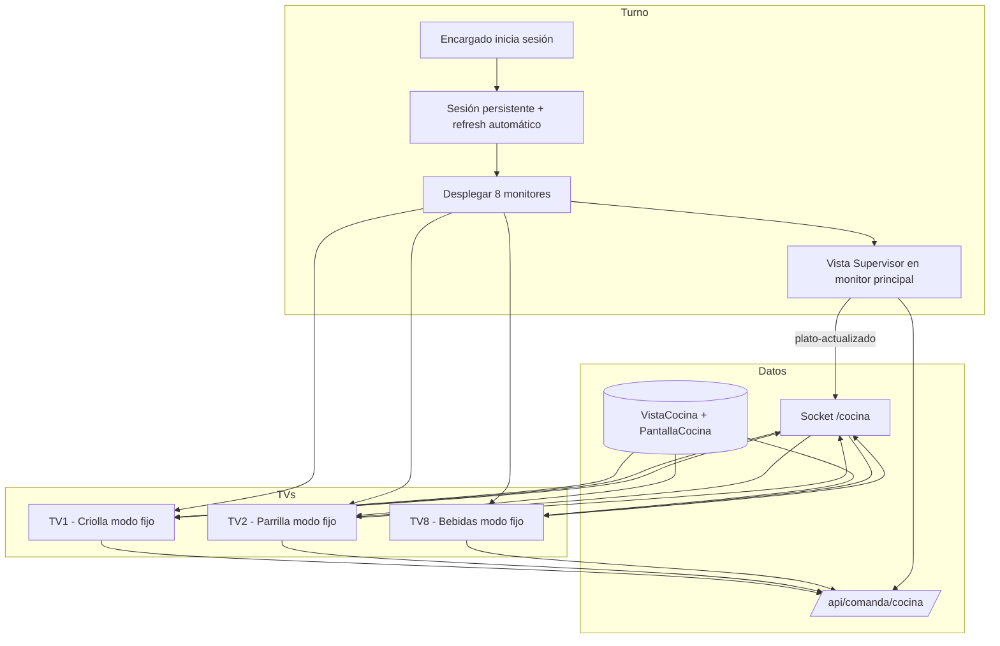

# Plan: Vista "Ver Cocina" — Monitor pasivo para cocineros

**Versión:** 2.0  
**Fecha:** Junio 2026  
**Proyecto:** App Cocina (`appcocina`) + Admin (`cocineros.html`) + Backend  
**Estado:** Planificación — sin implementar

**Cambios v2.0:** Sesión persistente sin cierre automático, modelo de permisos supervisor/cocinero, despliegue multi-pantalla (8 TVs desde un PC), modo monitor fijo y consola de despliegue.

---

## Resumen ejecutivo

Se agregará **"Ver Cocina"** en el menú principal de la App de Cocina: un monitor **solo lectura** para que los cocineros vean qué platos deben preparar, sin cambiar estados.

### Escenario operativo real (Las Gambusinas)

Una **persona encargada de manejar las comandas** (rol **supervisor** o **cocinero con permisos de supervisor**) opera desde **un solo PC** con **8 televisores** extendidos como pantallas adicionales. Esa persona:

1. Inicia sesión **una vez** al abrir el turno.
2. La sesión **no se cierra** durante toda la jornada (ni por inactividad ni por expiración de token).
3. Desde su PC despliega **Ver Cocina Personalizado** en cada TV, cada una con una **Vista de Cocina** distinta (Criolla, Parrilla, Postres, etc.).
4. Los cocineros en cada área **solo miran** su televisor; no interactúan con la app.
5. La misma sesión del encargado alimenta el **KDS interactivo** (Ver Comandas / Vista Supervisor) en el monitor principal del PC.

```
┌─────────────────────────────────────────────────────────────────────────────┐
│  PC ENCARGADO DE COMANDAS (Supervisor / Cocinero+Supervisor)                │
│  Monitor principal: Ver Comandas · Vista Supervisor · gestión del turno       │
│  Sesión única · persistente · sin cierre automático                         │
├─────────────────────────────────────────────────────────────────────────────┤
│  TV 1          TV 2          TV 3    ...    TV 8                            │
│  Vista         Vista         Vista          Vista                           │
│  Criolla       Parrilla      Postres        Bar / Bebidas                   │
│  (solo lectura, pantalla completa, sin menú ni logout)                      │
└─────────────────────────────────────────────────────────────────────────────┘
```

### Dos modos de Ver Cocina

| Modo | Propósito |
|------|-----------|
| **Ver Cocina Completo** | Todos los platos pendientes del día (panorama general) |
| **Ver Cocina Personalizado** | Solo platos de una **Vista de Cocina** — **modo principal para las 8 TVs** |

La personalización visual y la definición de vistas se gestionan en **`cocineros.html`** → pestaña **"Personalizar vista"** (junto a Zonas).

### Principio rector

> **Ver Cocina observa el mismo flujo de datos que el KDS, pero nunca escribe en el backend.**  
> La sesión del encargado es compartida por todas las ventanas; los monitores en TV son ventanas en **modo fijo** sin controles de gestión.

---

## 1. Contexto y diferencia con el KDS actual

### 1.1 Qué existe hoy

| Funcionalidad | Ubicación | Naturaleza |
|---------------|-----------|------------|
| Ver Comandas | `MenuPage.jsx` → `comandastyle.jsx` | Interactivo |
| Vista Personalizada (KDS) | `ComandastylePerso.jsx` | Interactivo + filtro por Zonas |
| Vista Supervisor | `ComandaStyleSupervi.jsx` | Interactivo + asignación de cocineros |
| Zonas | `cocineros.html` + `zona.model.js` | Filtros KDS por cocinero |
| Autenticación | `AuthContext.jsx` + `POST /api/admin/cocina/auth` | JWT 8h + logout por inactividad 30 min |

### 1.2 Qué se construye

```
MENÚ PRINCIPAL
├── Ver Comandas     → KDS interactivo (encargado en monitor principal)
├── Ver Cocina  ← NUEVO
│   ├── Ver Cocina Completo
│   └── Ver Cocina Personalizado  ← una ventana por TV
├── Tabla PPA
└── Configuración

cocineros.html
├── Cocineros
├── Zonas
└── Personalizar vista  ← NUEVO (CRUD Vistas de Cocina + mapeo pantallas)
```

---

## 2. Autenticación, permisos y sesión persistente

### 2.1 Modelo de usuario objetivo

El encargado de comandas inicia sesión con credenciales de **supervisor** o de **cocinero al que se le otorgaron permisos de supervisor**. Esto ya está soportado por el sistema de roles:

| Rol / permiso | Uso en este plan |
|---------------|------------------|
| `supervisor` | Acceso completo: KDS supervisor, desplegar 8 TVs, administrar vistas |
| `cocinero` + `ver-vista-supervisor-cocina` | Vista Supervisor en el KDS |
| `cocinero` + `utilidad-supervisor` | Tomar/finalizar platos de otros cocineros |
| `cocinero` + `ver-comandas-cocina` | Acceso base a la app |
| `ver-cocina-completo` | **Nuevo** — ver monitor completo |
| `ver-cocina-personalizado` | **Nuevo** — ver monitor filtrado / TVs |
| `desplegar-monitores-cocina` | **Nuevo** — abrir consola de 8 pantallas |
| `administrar-vistas-cocina` | **Nuevo** — CRUD en admin (supervisor/admin) |

**Recomendación:** Crear un rol personalizado **"Encargado de Cocina"** con:

```
ver-comandas-cocina, cambiar-estados-platos, revertir-comandas,
ver-vista-supervisor-cocina, utilidad-supervisor, ver-boton-prioridad-kds,
ver-cocina-completo, ver-cocina-personalizado, desplegar-monitores-cocina
```

No incluir permisos de dashboard admin salvo `administrar-vistas-cocina` si también configura vistas desde el panel web.

### 2.2 Problema actual — por qué la sesión se cierra

Hoy en `AuthContext.jsx`:

| Mecanismo | Valor actual | Efecto |
|-----------|--------------|--------|
| Expiración JWT | `8h` (`adminController.js` línea 353) | Logout automático al expirar |
| Check de expiración | Cada 60 s | `logout()` si token vencido |
| Inactividad | 30 min sin mouse/teclado | `logout()` — **crítico para TVs sin interacción** |
| Advertencia inactividad | 25 min | Modal que interrumpe |
| 401 en API | `apiClient` | Logout automático |

Las **8 TVs no reciben interacción** del usuario → la inactividad cerraría la sesión en todas las ventanas a los 30 minutos. **Esto debe eliminarse para la App Cocina.**

### 2.3 Requisito: sesión que nunca se cierre automáticamente

**Alcance:** App Cocina únicamente (cocinero y supervisor). No aplica a App Mozos ni dashboard admin.

**Comportamiento deseado:**

| Evento | Comportamiento nuevo |
|--------|----------------------|
| Login exitoso | Sesión activa hasta **logout manual** explícito |
| Sin actividad en TVs | **No** cerrar sesión |
| Token JWT próximo a vencer | **Renovar silenciosamente** (refresh) |
| Cierre de navegador / reinicio PC | Restaurar sesión desde `localStorage` si token válido o renovable |
| Logout manual | Solo desde monitor principal del encargado (no desde TVs) |

### 2.4 Diseño técnico — sesión persistente

#### Backend

Nuevo endpoint de renovación:

```
POST /api/admin/cocina/auth/refresh
Authorization: Bearer <token_actual>
→ { token, usuario, expiresAt }
```

Cambios en emisión del token inicial:

```javascript
// adminController.js — App Cocina
{ expiresIn: process.env.COCINA_JWT_EXPIRY || '30d' }  // antes: '8h'
```

Opcional: claim `sesionPersistente: true` en el JWT cuando el usuario tiene permiso `sesion-persistente-cocina` (o siempre para app cocina).

#### Frontend (`AuthContext.jsx`)

```javascript
// Nuevas constantes
const COCINA_PERSISTENT_SESSION = true;  // flag global app cocina
const INACTIVITY_TIMEOUT_MS = null;      // deshabilitado para app cocina
const TOKEN_REFRESH_MARGIN_MS = 24 * 60 * 60 * 1000; // renovar 24h antes

// Eliminar o condicionar:
// - logout por inactividad
// - showInactivityWarning
// - listener de mousedown/keydown para reset timer (solo en vistas interactivas si se desea)
```

**Renovación silenciosa:**

```
Cada 1h (o cuando remainingMs < TOKEN_REFRESH_MARGIN_MS):
  POST /auth/refresh
  → actualizar token en estado + localStorage (cocinaAuth)
  → reconectar socket con nuevo token (useSocketCocina)
```

**Protección en TVs (modo fijo):**

- Ocultar botón "Cerrar sesión"
- Ocultar navegación al menú (o requerir PIN de supervisor para salir)
- `beforeunload` solo informativo en ventanas TV

#### Almacenamiento

| Clave | Contenido |
|-------|-----------|
| `cocinaAuth` | `{ token, usuario, sesionPersistente: true }` |
| `cocinaSessionStartedAt` | Timestamp inicio de turno (métricas) |
| `cocinaMonitorWindows` | Config de ventanas desplegadas (opcional) |

### 2.5 Seguridad — equilibrio operativo

La sesión persistente es un requisito de negocio para TVs de cocina. Mitigaciones:

| Riesgo | Mitigación |
|--------|------------|
| PC encargado desatendido | Logout manual al fin de turno; capacitación |
| Token robado de localStorage | JWT con `app: 'cocina'`; refresh invalida token anterior (fase 2) |
| TVs accesibles físicamente | Modo fijo sin menú; sin datos sensibles en monitor |
| Turnos largos (&gt; 30 días) | Refresh automático indefinido mientras el backend esté activo |

**Logout manual obligatorio al cierre de turno** — mensaje en Vista Supervisor al detectar hora de cierre configurada (opcional, fase 2).

---

## 3. Despliegue multi-pantalla — 8 televisores desde un PC

### 3.1 Arquitectura física

```
                    ┌──────────────────┐
                    │   PC Windows     │
                    │   GPU + 8 outputs│
                    │   (o 2 GPUs /    │
                    │    splitters)    │
                    └────────┬─────────┘
         ┌──────────┬───────┴───────┬──────────┐
         ▼          ▼               ▼          ▼
      Monitor    TV-1 ... TV-7    TV-8
      principal  (HDMI)           (HDMI)
      Encargado  Cocina área      Cocina área
      KDS activo por estación
```

**Requisitos hardware recomendados:**

- Windows 10/11 con **8 monitores** en modo extendido (no duplicar)
- GPU con suficientes salidas o adaptadores DisplayPort → HDMI
- Cables HDMI de calidad para distancias de cocina (≤ 15 m con extensor activo si hace falta)
- PC con **8 GB+ RAM** y SSD — 9 instancias de Chromium (1 encargado + 8 TVs) consumen ~2–4 GB

### 3.2 Modelo lógico — Pantalla de Cocina

Nueva entidad que vincula **índice de monitor físico** con **Vista de Cocina**:

**Archivo:** `backend-gambusinas/src/database/models/pantallaCocina.model.js`

```javascript
{
  numeroPantalla: Number,      // 1–8 (o más)
  nombre: String,              // "TV Criolla - Pared norte"
  vistaCocinaId: ObjectId,     // ref VistaCocina
  activo: Boolean,
  orden: Number,               // para UI de despliegue
  configDespliegue: {
    anchoVentana: Number,      // px, default pantalla completa del monitor
    altoVentana: Number,
    posicionX: Number,         // offset en desktop extendido
    posicionY: Number,
    pantallaCompleta: Boolean, // default true
    ocultarCursor: Boolean,    // default true en TVs
    ocultarBarraTareas: Boolean
  }
}
```

En admin (**Personalizar vista**), sección **"Pantallas de cocina"**:

| Pantalla | Vista asignada | Área física |
|----------|----------------|-------------|
| TV 1 | Criolla | Estación criolla |
| TV 2 | Parrilla | Parrilla |
| TV 3 | Freír | Freidora |
| … | … | … |
| TV 8 | Bebidas | Bar |

### 3.3 URLs de despliegue directo (deep link)

Cada TV abre una URL fija que restaura la vista sin pasar por el menú:

```
https://cocina.lasgambusinas.local/?monitor=1&vistaId=abc123&modo=fijo
```

Parámetros:

| Param | Descripción |
|-------|-------------|
| `monitor` | Número de pantalla (1–8) |
| `vistaId` | ID de VistaCocina (override del mapeo en BD) |
| `modo=fijo` | Modo monitor: sin menú, sin logout, pantalla completa |
| `token` | **No en URL** — usa `localStorage` compartido del mismo origen |

**Importante:** Todas las ventanas deben ser del **mismo origen** (`localhost:3000` o dominio cocina) para compartir `cocinaAuth` en `localStorage`.

### 3.4 Consola "Desplegar monitores" (App Cocina)

Nueva opción en el menú principal — visible con permiso `desplegar-monitores-cocina`:

```
┌─────────────────────────────────────────────────────────────┐
│  DESPLEGAR MONITORES DE COCINA                              │
├─────────────────────────────────────────────────────────────┤
│  ☑ TV 1 → Criolla (1920×1080 @ 0,0)      [Abrir] [Probar]  │
│  ☑ TV 2 → Parrilla (1920×1080 @ 1920,0)  [Abrir] [Probar]  │
│  ...                                                         │
│  ☑ TV 8 → Bebidas                        [Abrir] [Probar]  │
│                                                              │
│  [ Desplegar todas las seleccionadas ]  [ Cerrar todas ]    │
└─────────────────────────────────────────────────────────────┘
```

**Flujo:**

1. Encargado inicia sesión en monitor principal.
2. Abre **Desplegar monitores**.
3. Pulsa **Desplegar todas** → la app abre 8 ventanas con `window.open()`, posicionadas con `left`/`top` según `configDespliegue` de cada `PantallaCocina`.
4. Cada ventana navega a `VER_COCINA_PERSONALIZADO` en `modo=fijo` con su `vistaId`.
5. Ventanas entran en pantalla completa (`requestFullscreen`).

**API de ventanas (navegador):**

```javascript
// utils/monitorWindowManager.js
function abrirMonitorPantalla(pantalla) {
  const url = `${window.location.origin}/?monitor=${pantalla.numeroPantalla}&vistaId=${pantalla.vistaCocinaId}&modo=fijo`;
  const features = [
    `left=${pantalla.configDespliegue.posicionX}`,
    `top=${pantalla.configDespliegue.posicionY}`,
    `width=${pantalla.configDespliegue.anchoVentana}`,
    `height=${pantalla.configDespliegue.altoVentana}`,
    'menubar=no,toolbar=no,location=no,status=no'
  ].join(',');
  return window.open(url, `cocina-monitor-${pantalla.numeroPantalla}`, features);
}
```

**Limitación navegador:** `window.open` múltiple puede ser bloqueado por popup blocker — la consola debe abrir la primera ventana con click del usuario y luego encadenar el resto, o usar **Gambusinas Launcher** (fase 2) para control nativo de ventanas.

### 3.5 Modo fijo (`modo=fijo`) — comportamiento UI

Cuando `modo=fijo` está activo en `CocinaMonitorPersonalizado`:

| Elemento | Visible |
|----------|---------|
| Lista de platos + cronómetros | Sí |
| Nombre de la vista ("CRIOLLA") | Sí |
| Reloj / contador pendientes | Sí |
| Botón Menú | **No** |
| Botón Cerrar sesión | **No** |
| Selector de otras vistas | **No** (bloqueado a la vista asignada) |
| Panel apariencia ⚙ | **No** (config solo desde admin) |
| Cursor del mouse | Oculto tras 5 s sin movimiento (CSS `cursor: none`) |

**Salida de emergencia:** `Ctrl+Shift+M` → modal con PIN de supervisor para volver al menú (evita que personal de limpieza cierre la vista).

### 3.6 Arranque automático del turno

Procedimiento recomendado al inicio del día:

1. Encender PC y TVs.
2. Abrir **Gambusinas Launcher** → App Cocina (o acceso directo Chrome).
3. Login del encargado (una vez).
4. **Desplegar monitores** → 8 TVs activas.
5. En monitor principal: **Ver Comandas → Vista Supervisor**.

Al fin del turno:

1. Cerrar ventanas de monitores (botón "Cerrar todas" en consola).
2. **Cerrar sesión** manual en monitor principal.

### 3.7 Alternativa: Gambusinas Launcher (fase 2)

Para evitar limitaciones del navegador con 8 ventanas:

- Launcher nativo Windows lee `pantallasCocina` del backend.
- Abre 8 procesos/ventanas Chromium embebidas posicionadas por monitor index (`user32.EnumDisplayMonitors`).
- Comparte perfil de usuario para `localStorage` común.
- Inicia en modo kiosko por pantalla.

Referencia: `backend-gambusinas/docs/PLAN_LAUNCHER_NATIVO_WINDOWS.md`

### 3.8 Configuración Windows recomendada

| Setting | Valor |
|---------|-------|
| Energía | Nunca suspender pantallas ni PC |
| Screensaver | Desactivado en todas las pantallas |
| Actualizaciones Windows | Horario fuera de servicio |
| Chrome | `--disable-session-crashed-bubble --noerrdialogs` |
| Inicio automático | Launcher o script `.bat` al boot (opcional) |

---

## 4. Estados de plato — criterio de visibilidad

### 4.1 Mapeo de estados

| Etiqueta | Estado backend | ¿Visible en Ver Cocina? |
|----------|----------------|-------------------------|
| En cola / esperando | `pedido`, `en_espera` | **Sí** |
| Tomado por cocinero | `procesandoPor` set | **Sí** (+ badge opcional) |
| Listo para recoger | `recoger` | **No** — desaparece |
| Salió / entregado | `salio`, `entregado`, `pagado` | No |

### 4.2 Regla de filtrado

```javascript
// Incluir
plato.estado ∈ ['pedido', 'en_espera'] && !plato.anulado && !plato.eliminado

// Excluir (desaparece)
plato.estado === 'recoger' || estados posteriores
```

### 4.3 Tiempo real

- **REST:** `GET /api/comanda/cocina/:fecha`
- **Socket:** `/cocina` — `plato-actualizado`, `plato-actualizado-batch`, `comanda-actualizada`, `nueva-comanda`
- **Hook:** `useCocinaMonitorData.js` (solo lectura, sin `useProcesamiento`)

**Reconexión socket:** Tras refresh de token, `useSocketCocina` debe re-autenticar sin perder la lista (patrón existente + `disconnect`/`connect` con nuevo token).

---

## 5. Navegación y rutas (App Cocina)

### 5.1 `MenuPage.jsx` — opciones principales

```javascript
// Nuevo en mainOptions
{
  id: 'ver-cocina',
  title: 'Ver Cocina',
  subtitle: 'Monitor de platos por preparar',
  icon: FaTv,
  action: () => setShowCocinaViewSelector(true),
  enabled: hasPermission('ver-cocina-completo') || hasPermission('ver-cocina-personalizado'),
},
// Nuevo — solo encargado
{
  id: 'desplegar-monitores',
  title: 'Desplegar Monitores',
  subtitle: 'Abrir vistas en las 8 TVs de cocina',
  icon: FaDesktop,
  action: () => onNavigate('DESPLEGAR_MONITORES'),
  enabled: hasPermission('desplegar-monitores-cocina'),
}
```

### 5.2 Rutas en `App.jsx`

```javascript
VER_COCINA_COMPLETO        → CocinaMonitorCompleto.jsx
VER_COCINA_PERSONALIZADO   → CocinaMonitorPersonalizado.jsx
DESPLEGAR_MONITORES        → DesplegarMonitoresPage.jsx
```

**Arranque por URL** (`App.jsx`):

```javascript
// Al montar, si ?monitor=3&modo=fijo → saltar menú, ir directo a monitor
const params = new URLSearchParams(window.location.search);
if (params.get('modo') === 'fijo' && params.get('monitor')) {
  setCurrentView('VER_COCINA_PERSONALIZADO');
  setMonitorOptions({ fijo: true, monitor: params.get('monitor'), vistaId: params.get('vistaId') });
}
```

### 5.3 Persistencia

| Clave | Valor |
|-------|-------|
| `cocinaLastView` | Incluir vistas monitor |
| `cocinaMonitorMode` | `completo` \| `personalizado` |
| `cocinaMonitorVistaId` | Vista activa |
| `cocinaMonitorFijo` | `{ monitor: 1–8, vistaId }` por ventana |

---

## 6. Diseño de la vista — Ver Cocina

### 6.1 Layout (optimizado para TV 55"–65", viewing distance 2–4 m)

```
┌──────────────────────────────────────────────────────────────────────────┐
│  🍲 CRIOLLA — ÁREA 1                              Pendientes: 7   14:32  │
├──────────────────────────────────────────────────────────────────────────┤
│  AJÍ DE GALLINA ×2                              Mesa 14      ⏱ 12:34  │
│  Sin picante                                                    🔴      │
├──────────────────────────────────────────────────────────────────────────┤
│  SECO DE RES ×1                                  #1284        ⏱ 08:12  │
│                                                                  🟡      │
├──────────────────────────────────────────────────────────────────────────┤
│  ... auto-scroll si overflow ...                                         │
└──────────────────────────────────────────────────────────────────────────┘
```

En **modo fijo** no hay botones en el header — solo información.

### 6.2 Campos por fila

| Campo | Prioridad | Modo TV |
|-------|-----------|---------|
| Nombre del plato | Obligatorio | Fuente grande (32–48 px) |
| Cantidad | Obligatorio | Junto al nombre `×N` |
| Cronómetro | Obligatorio | Derecha, color alerta |
| Complementos / notas | Si existen | Texto secundario |
| Mesa / comanda | Recomendado | Texto secundario |
| `procesandoPor` | Opcional | Badge pequeño — en TVs suele ocultarse |
| Prioridad urgente | Si aplica | Badge 🔴 |

### 6.3 Presets visuales para TV

| Preset | `tamanioFuentePlato` | Uso |
|--------|----------------------|-----|
| TV 55" @ 3 m | 36 px | Default TVs cocina |
| TV 65" @ 4 m | 42 px | Áreas grandes |
| TV 43" @ 2 m | 28 px | Estaciones compactas |

Configurar en **Vista de Cocina** → `configVisual` en admin, no en la TV.

---

## 7. Vista de Cocina y Personalizar vista (admin)

### 7.1 Entidad `VistaCocina`

```javascript
{
  nombre: String,              // "Criolla"
  descripcion: String,
  color: String,
  icono: String,
  activo: Boolean,
  filtrosPlatos: {
    modoInclusion: Boolean,
    platosPermitidos: [Number],
    categoriasPermitidas: [String],
    tiposPermitidos: [String]
  },
  configVisual: { /* fuentes, colores, preset TV */ },
  ordenamiento: { criterio, direccion },
  creadoPor, actualizadoPor, timestamps
}
```

### 7.2 API

| Método | Endpoint |
|--------|----------|
| GET/POST/PUT/DELETE | `/api/vistas-cocina` |
| GET/PUT | `/api/pantallas-cocina` |
| PUT | `/api/pantallas-cocina/despliegue` — guardar posiciones detectadas |

### 7.3 Tab en `cocineros.html`

```
[ Cocineros ]  [ Zonas ]  [ Personalizar vista ]
```

Sub-secciones:

1. **Vistas de cocina** — CRUD de presets de platos + apariencia TV  
2. **Pantallas (TV 1–8)** — asignar vista a cada monitor + coordenadas de ventana  
3. **Vista previa** — simulador de cómo se verá en TV

---

## 8. Arquitectura de componentes

```
appcocina/src/
├── components/
│   ├── pages/
│   │   ├── MenuPage.jsx
│   │   └── DesplegarMonitoresPage.jsx       ← NUEVO
│   ├── monitor/
│   │   ├── CocinaMonitorCompleto.jsx
│   │   ├── CocinaMonitorPersonalizado.jsx
│   │   ├── CocinaMonitorLayout.jsx          (soporta modo=fijo)
│   │   ├── PlatoMonitorRow.jsx
│   │   ├── MonitorEmptyState.jsx
│   │   └── MonitorSalidaEmergencia.jsx      (Ctrl+Shift+M)
│   └── App.jsx
├── hooks/
│   ├── useCocinaMonitorData.js
│   ├── useCocinaMonitorFilter.js
│   ├── useCocinaMonitorTimer.js
│   └── useSesionPersistente.js              ← NUEVO (refresh token)
├── contexts/
│   ├── VistaCocinaConfigContext.jsx
│   └── AuthContext.jsx                      (modificar: sin inactividad)
└── utils/
    ├── cocinaMonitorFilters.js
    └── monitorWindowManager.js              ← NUEVO
```

---

## 9. Diagrama de flujo completo



---

## 10. Recomendaciones UX

### 10.1 Para cocineros frente a la TV

1. **Un plato por fila, máximo contraste** — fondo oscuro, texto blanco, acento dorado Gambusinas.  
2. **Cronómetro grande a la derecha** — es la señal principal de urgencia.  
3. **Sin información de comanda completa** — solo lo necesario para cocinar ese ítem.  
4. **Nombre de estación siempre visible** — "CRIOLLA" en header fijo.  
5. **Empty state positivo** — "Sin platos pendientes en esta estación ✓".  
6. **Sin parpadeos** — actualizaciones socket en silencio; animación suave al entrar/salir platos.  
7. **Auto-scroll** cada 25–30 s si la lista excede la pantalla.  
8. **No mostrar quién tomó el plato en TV** — reduce ruido; el encargado lo ve en el KDS.  
9. **Máximo 8–12 platos visibles** por vista — si hay más tipos de plato, crear otra vista/TV.  
10. **Complementos en mayúsculas o color acento** — errores de preparación son costosos.

### 10.2 Para el encargado de comandas

1. **Un solo login al inicio del turno** — confiar en sesión persistente.  
2. **Consola de despliegue** con estado de cada TV (conectada / desconectada / última actualización socket).  
3. **Botón "Cerrar todas las TVs"** al fin del turno antes del logout.  
4. **Monitor principal siempre en Vista Supervisor** — control centralizado.  
5. **Probar cada TV** con botón "Probar" antes del servicio.  
6. **Documento físico** en cocina: mapa TV → estación → vista.

### 10.3 Para configuración en admin

1. **Crear vistas por estación física**, no por cocinero individual.  
2. **Duplicar vista desde zona** cuando KDS y TV comparten los mismos platos.  
3. **Preset "TV 55 pulgadas"** en config visual.  
4. **Asignar pantalla 1–8** con nombre del área física ("TV Pared norte").  
5. **Calibrar posiciones** una vez: botón "Detectar monitores" guarda resolución/offset.

### 10.4 Distribución sugerida de 8 TVs (ejemplo)

| TV | Vista sugerida | Platos típicos |
|----|----------------|----------------|
| 1 | Criolla | Ají, seco, tacu tacu, arroz con pollo |
| 2 | Parrilla | Anticuchos, brochetas, carnes |
| 3 | Plancha / Salteados | Lomo saltado, tallarines, saltados |
| 4 | Freír | Papas, chicharrón, pescado frito |
| 5 | Sopas / Caldos | Sopa, chupe, caldo de gallina |
| 6 | Ensaladas / Fríos | Ensaladas, ceviche, entradas frías |
| 7 | Postres | Suspiro, mazamorra, helados |
| 8 | Bebidas / Bar | Jugos, cócteles, café |

Ajustar según carta real del restaurante.

---

## 11. Fases de implementación

### Fase 1 — Fundamentos (crítico para operación)

| # | Tarea | Prioridad |
|---|-------|-----------|
| 1 | **Sesión persistente** — deshabilitar inactividad, JWT largo, endpoint refresh | **P0** |
| 2 | Permisos nuevos en `roles.model.js` | P0 |
| 3 | Botón Ver Cocina + modal en `MenuPage.jsx` | P0 |
| 4 | `CocinaMonitorPersonalizado` + `modo=fijo` | P0 |
| 5 | `useCocinaMonitorData` + filtros de estado | P0 |
| 6 | Modelo `VistaCocina` + API | P0 |
| 7 | Tab Personalizar vista en `cocineros.html` | P1 |
| 8 | `CocinaMonitorCompleto` | P1 |

### Fase 2 — Multi-pantalla

| # | Tarea |
|---|-------|
| 9 | Modelo `PantallaCocina` + mapeo TV 1–8 |
| 10 | `DesplegarMonitoresPage` + `monitorWindowManager.js` |
| 11 | Deep link `?monitor=&modo=fijo` en `App.jsx` |
| 12 | Indicador de estado socket por ventana en consola |
| 13 | Salida de emergencia `Ctrl+Shift+M` |
| 14 | Presets visuales TV en admin |

### Fase 3 — Robustez

| # | Tarea |
|---|-------|
| 15 | Integración Gambusinas Launcher (ventanas nativas) |
| 16 | Invalidación de token en refresh (rotación) |
| 17 | Recordatorio logout fin de turno |
| 18 | "Crear vista desde zona" |
| 19 | Métricas de uptime por pantalla |

---

## 12. Criterios de aceptación

### Sesión persistente

- [ ] Tras login, la sesión **no** se cierra por 8+ horas sin interacción en TVs
- [ ] No aparece modal de inactividad a los 25 min
- [ ] El token se renueva automáticamente antes de expirar
- [ ] Tras reiniciar el navegador, la sesión se restaura si el turno sigue activo
- [ ] Logout manual funciona solo desde monitor principal / menú encargado
- [ ] TVs en modo fijo no muestran botón de cerrar sesión

### Permisos supervisor / cocinero

- [ ] Cocinero con `utilidad-supervisor` + `ver-vista-supervisor-cocina` accede a Vista Supervisor
- [ ] Encargado con `desplegar-monitores-cocina` ve opción Desplegar Monitores
- [ ] Usuario sin permisos de Ver Cocina no ve el botón en el menú

### Ver Cocina (funcional)

- [ ] Platos en `pedido`/`en_espera` visibles; al pasar a `recoger` desaparecen en &lt; 2 s
- [ ] Vista personalizada filtra solo platos de la Vista de Cocina
- [ ] Modo fijo: sin menú, sin selector de vistas, pantalla completa
- [ ] Config visual de la vista se aplica correctamente en TV

### Multi-pantalla (8 TVs)

- [ ] Admin permite asignar Vista de Cocina a pantallas 1–8
- [ ] Consola despliega 8 ventanas en posiciones configuradas
- [ ] Cada TV muestra solo su vista asignada
- [ ] Las 8 ventanas comparten sesión y reciben actualizaciones socket
- [ ] Botón "Cerrar todas" cierra ventanas de monitores
- [ ] Mapa de prueba: 8 TVs operativas durante servicio simulado de 2+ horas sin logout

### Admin

- [ ] CRUD Vistas de Cocina en Personalizar vista
- [ ] CRUD Pantallas de cocina con asignación vista ↔ TV
- [ ] Preview de apariencia TV

---

## 13. Riesgos y mitigaciones

| Riesgo | Mitigación |
|--------|------------|
| Popup blocker impide abrir 8 ventanas | Consola con instrucciones; Launcher nativo fase 3 |
| `localStorage` no compartido entre perfiles Chrome | Mismo perfil de usuario Windows; documentar |
| 9 ventanas Chrome consumen RAM | PC dedicado 16 GB; cerrar pestañas innecesarias |
| Sesión eterna = riesgo seguridad | Logout manual obligatorio; capacitación fin de turno |
| Token refresh falla de noche | Reintentos exponenciales; banner en consola encargado |
| Confusión Zonas vs Vistas de Cocina | Nombres claros; wizard "crear desde zona" |
| Cocinero toca TV esperando interactuar | Sin affordances click; cartel "Solo consulta" |

---

## 14. Referencias en el codebase

| Recurso | Ruta |
|---------|------|
| Auth + inactividad + JWT | `appcocina/src/contexts/AuthContext.jsx` |
| Login cocina + JWT 8h | `backend-gambusinas/src/controllers/adminController.js` |
| Permisos sistema | `backend-gambusinas/src/database/models/roles.model.js` |
| Menú principal | `appcocina/src/components/pages/MenuPage.jsx` |
| Router | `appcocina/src/components/App.jsx` |
| KDS + supervisor | `appcocina/src/components/Principal/ComandaStyleSupervi.jsx` |
| Sockets | `appcocina/src/hooks/useSocketCocina.js` |
| Zonas (referencia filtros) | `backend-gambusinas/src/database/models/zona.model.js` |
| Admin cocineros | `backend-gambusinas/public/cocineros.html` |
| Launcher Windows | `backend-gambusinas/docs/PLAN_LAUNCHER_NATIVO_WINDOWS.md` |
| Plan v1 | `appcocina/docs/PLAN_VISTA_VER_COCINA.md` |

---

## 15. Glosario

| Término | Significado |
|---------|-------------|
| **Ver Cocina** | Monitor pasivo de platos pendientes |
| **Ver Comandas** | KDS interactivo |
| **Encargado de comandas** | Supervisor o cocinero con permisos supervisor |
| **Modo fijo** | Vista TV sin navegación ni logout |
| **Vista de Cocina** | Preset de platos + apariencia para un monitor |
| **Pantalla de Cocina** | Mapeo TV física (1–8) → Vista de Cocina |
| **Sesión persistente** | Sin cierre automático durante el turno |
| **Desplegar monitores** | Abrir las 8 ventanas en sus TVs |

---

*Documento v2.0 — listo para revisión e inicio de Fase 1 (sesión persistente + monitor básico).*
